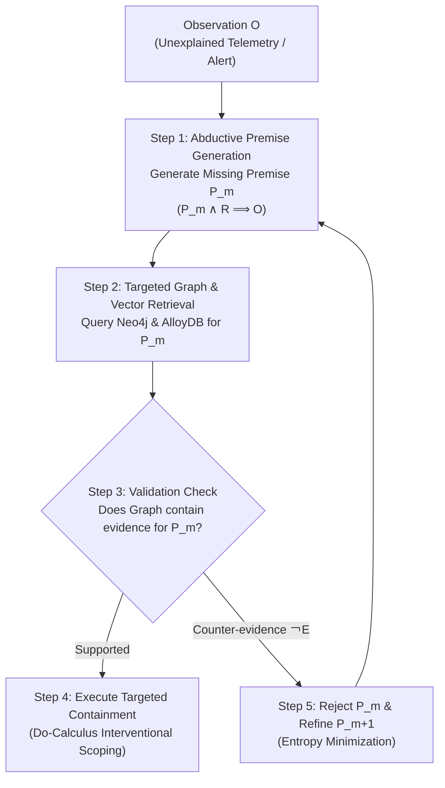

# Abductive Inference & Missing Premise Generation Playbook

## 1. Overview

Standard Retrieval-Augmented Generation (RAG) and SIEM log searches rely on **deductive similarity** (matching query terms directly against known log schemas and runbooks). When faced with novel zero-day exploits, obfuscated PowerShell/script commands, or unknown threat actor techniques, direct similarity queries fail because the raw observation does not match existing signatures.

This playbook provides step-by-step guidance for executing **Abductive RAG** by generating and validating **Missing Premises** ($P_m \land R \implies O$) before executing database queries or containment actions.

---

## 2. Core Abductive Workflow

---

## 3. Execution Steps

### Step 1: Formulate the Missing Premise ($P_m$)
When an alert or telemetry anomaly $O$ lacks an explicit SIEM detection match:
1. Identify the **Observation ($O$)**: What specific event or payload was detected? (e.g. `Custom process svchost_custom.exe opened handle to lsass.exe`).
2. Identify the **General Rule ($R$)**: What core security principle applies? (e.g. `Accessing LSASS memory handles is required to dump domain credentials`).
3. Generate the **Missing Premise ($P_m$)**: What unobserved attacker action or intent explains $O$? (e.g. `Attacker is attempting credential dumping via handle cloning`).

### Step 2: Targeted Grounding Retrieval
Instead of querying SIEM logs with raw payload strings from $O$, query the knowledge base with $P_m$:
* **Graph Database (Neo4j):** Run Cypher queries for entities associated with $P_m$ (e.g. `MATCH (u:User)-[r:LOGGED_ON_TO]->(h:Host) WHERE h.name = $target RETURN path`).
* **Vector Store (AlloyDB / Elasticsearch):** Query historical incident reports using semantic embedding of $P_m$ (`query_alloydb_detection_reports`).

### Step 3: Dual-Loop Validation Check
Verify whether the retrieved evidence supports or invalidates $P_m$:
* **Supporting Evidence ($E$):** Prior privilege escalation events, abnormal network connections, or matching past detection reports.
* **Counter-Evidence ($\neg E$):** Known IT administrative automation schedules, approved patch management scripts, or verified system service hashes.

### Step 4: Interventional Blast Radius Containment
Before triggering destructive containment (e.g., host isolation), evaluate Pearl's **Do-Calculus operator** $\text{do}(\text{isolate}(H))$:
1. Query Neo4j for dependent active services running on host $H$.
2. Verify that host isolation will not cause unpredicted cascade outages on non-compromised production systems.
3. Execute gated containment with full audit logging.

### Step 5: Iterative Premise Refinement
If counter-evidence $\neg E$ invalidates premise $P_m$:
1. Reject $P_m$.
2. Formulate refined candidate premise $P_{m+1}$ using entropy minimization:

$$\hat{P}_m = \arg\min_{P_m} \left[ H(P_m \mid R) + \alpha \cdot D_{KL}(P(O \mid P_m, R) \parallel P(O \mid R)) \right]$$

3. Re-evaluate against the grounding databases until convergence ($\le 3$ turns).

---

## 4. References & Academic Citations

* **Josephson, J. R., & Josephson, S. G. (1994).** *Abductive Inference: Computation, Philosophy, Technology*. Cambridge University Press.
* **Pearl, J. (2009).** *Causality: Models, Reasoning, and Inference* (2nd ed.). Cambridge University Press.
* **Evans, O., Stuhlmüller, A., & Goodman, N. D. (2023).** *"The Optimal Choice of Hypothesis Is the Weakest, Not the Shortest"*. [arXiv:2301.12987v4](https://arxiv.org/abs/2301.12987).
* **Milajerdi, S. M., et al. (2019).** *"HOLMES: Real-time APT Detection through Correlation of Suspicious Events Targeted Towards a High-level Attack Graph"*, IEEE S&P '19.
