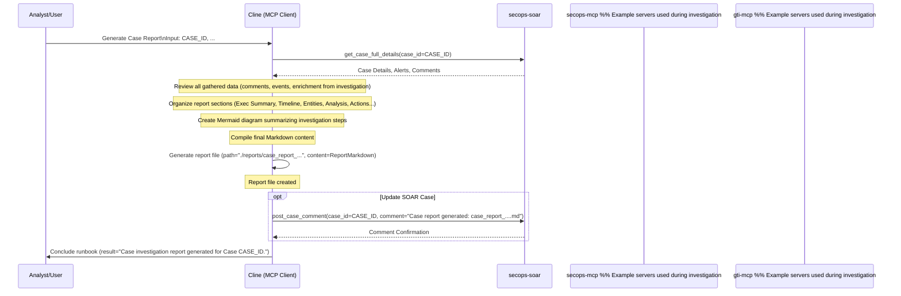

# Runbook: Generate Case Investigation Report

## Objective

To consolidate findings from a completed investigation for a specific SOAR case into a comprehensive report suitable for stakeholders, management review, or post-incident analysis. This runbook creates structured documentation that captures the investigation methodology, key findings, timeline of events, and final conclusions in a format suitable for technical and non-technical audiences.

## Scope

Summarizes key alerts, events, entity analysis, enrichment data, actions taken, and conclusions for a single case. Includes visualization of the investigation workflow and timeline of key events. Does not typically involve new investigation steps - focuses on synthesizing existing case data, comments, and findings into a coherent narrative. Excludes real-time investigation activities or new data collection.

## Inputs

*   `${CASE_ID}`: The SOAR case ID for which the report is being generated.
*   *(Optional) `${REPORT_FILENAME_SUFFIX}`: A suffix for the report filename.*
*   *(Optional) `${ADDITIONAL_CONTEXT}`: Any specific points or findings the analyst wants to ensure are included.*

## Tools

*   `secops-soar`: `get_case_full_details`, `list_alerts_by_case`, `list_events_by_alert`, `post_case_comment` (Potentially others depending on what needs summarizing)
*   `secops-mcp`: `lookup_entity`, `search_security_events` (If summarizing previous searches)
*   `gti-mcp`: Various `get_*_report` tools (If summarizing previous enrichment)
*   **Action:** Generate report file (e.g., using `write_to_file`)

## Workflow Steps & Diagram

1.  **Gather Case Data:** Retrieve all relevant data for `${CASE_ID}` using `get_case_full_details` (includes basic case info, alerts, comments). Potentially re-run `list_events_by_alert` for key alerts if needed.
2.  **Create Report Generation Todo List:** For complex cases, create a todo list following `common_steps/todo_list_generation.md` to track report sections and ensure comprehensive coverage. Include tasks for each major section of the report.
3.  **Synthesize Findings:** Review case comments, alert details, event summaries, and previous enrichment data associated with the case.
4.  **Structure Report:** Organize the information according to a standard template (referencing `.clinerules/reporting_templates.md`). Key sections might include: Executive Summary, Timeline of Key Events, Involved Entities & Enrichment, Analysis/Root Cause (if determined), Actions Taken, Recommendations/Lessons Learned. **Include the investigation todo list tracking as part of the methodology section.**
5.  **Generate Mermaid Diagram:** Create a Mermaid sequence diagram summarizing the *investigation workflow* that was performed for this case (which tools were used in what order).
6.  **Format Report:** Compile the synthesized information and the Mermaid diagram into a final Markdown report.
7.  **Generate report file:** Save the report with a standardized name (e.g., `./reports/case_report_${CASE_ID}_${timestamp}.md`).
8.  **(Optional) Update Case:** Add a comment to the SOAR case indicating the report has been generated and its location using `post_case_comment`.

## Completion Criteria

- Complete case data gathered including all alerts, events, comments, and enrichment findings
- Investigation timeline reconstructed with key events properly sequenced
- All involved entities documented with their enrichment status and findings
- Investigation methodology and tools used clearly documented
- Executive summary created suitable for management consumption
- Technical findings section completed with specific IOCs, TTPs, and evidence
- Analysis section includes root cause determination (if identified)
- Actions taken section documents all containment, mitigation, or remediation steps
- Recommendations section provides lessons learned and improvement suggestions
- Mermaid diagram created showing investigation workflow and tool usage
- Report saved in standardized format with proper naming convention
- SOAR case updated with report location and completion status
- Report ready for stakeholder distribution and archival

## Expected Outputs
- **YAML Frontmatter**: Report metadata
- **Investigation Report File**: Comprehensive Markdown report (saved as `./reports/case_report_${CASE_ID}_${timestamp}.md`)
- **Executive Summary**: High-level overview suitable for management
- **Technical Timeline**: Detailed sequence of events and investigative actions
- **Entity Analysis**: Summary of all involved entities and their risk assessment
- **Workflow Diagram**: Mermaid visualization of investigation process
- **SOAR Documentation**: Case comment indicating report completion and location
- **Recommendations**: Actionable items for process or security improvements
