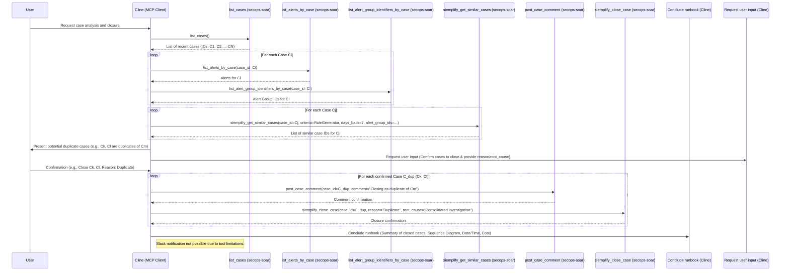

## Close duplicate/similar Cases Workflow

## Rubric

### 1. Case Identification (20 Points)
*   **Listing Cases (10 Points):** Did the agent list recent cases (`list_cases`) to identify the pool for analysis?
*   **Similarity Check (10 Points):** Did the agent use `siemplify_get_similar_cases` to identify potential duplicates?

### 2. User Interaction (20 Points)
*   **Confirmation (20 Points):** Did the agent present the potential duplicates to the user and explicitly ask for confirmation before closing?

### 3. Execution (20 Points)
*   **Documentation (10 Points):** Did the agent post a comment (`post_case_comment`) to the duplicate case referencing the original?
*   **Closure (10 Points):** Did the agent correctly close the duplicate case (`siemplify_close_case`) with the appropriate reason?

### 4. Visual Summary (10 Points)
*   **Sequence Diagram (10 Points):** Did the agent produce a valid Mermaid sequence diagram summarizing the actions taken during the execution?

### 5. Operational Metadata (10 Points)
*   **Date/Time (5 Points):** Did the agent record the date and time of the execution?
*   **Cost/Runtime (5 Points):** Did the agent attempt to record token usage and runtime duration (or note if unavailable)?

### 6. Resilience & Quality (10 Points)
*   **Error Handling (5 Points):** Did the agent handle any tool failures or invalid inputs gracefully without crashing or hallucinating?
*   **Output Formatting (5 Points):** Is the final output well-structured and free of internal monologue artifacts?

### Critical Failures (Automatic Failure)
*   Closing a case without user confirmation.
*   Closing the *original* case instead of the *duplicate*.
*   Failing to document the link between the cases before closing.
