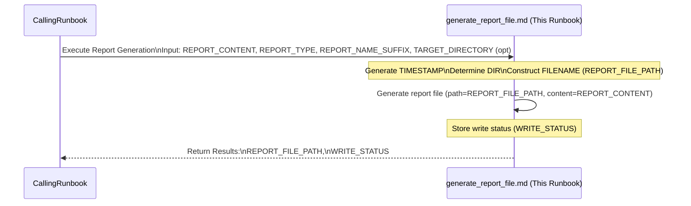

# Common Step: Generate Report File

## Objective

Save generated report content (typically Markdown) to a file with a standardized naming convention.

## Scope

This sub-runbook executes the "Generate report file" action. It assumes the report content and necessary metadata for filename construction are provided by the calling runbook.

## Inputs

*   `${REPORT_CONTENT}`: The full content of the report (usually Markdown text).
*   `${REPORT_TYPE}`: A short identifier for the type of report (e.g., "alert_report", "ioc_enrichment", "hunt_summary").
*   `${REPORT_NAME_SUFFIX}`: A descriptive suffix for the report name (e.g., the Case ID, IOC value, hunt name).
*   *(Optional) `${TARGET_DIRECTORY}`: The directory to save the report in (defaults to `./reports/`).*

## Outputs

*   `${REPORT_FILE_PATH}`: The full path to the saved report file.
*   `${WRITE_STATUS}`: Confirmation or status of the file writing attempt.

## Tools

*   **Action:** Generate report file (e.g., using `write_to_file`)

## Workflow Steps & Diagram

1.  **Receive Input:** Obtain `${REPORT_CONTENT}`, `${REPORT_TYPE}`, `${REPORT_NAME_SUFFIX}`, and optionally `${TARGET_DIRECTORY}` from the calling runbook.
2.  **Construct Filename:**
    *   Generate a timestamp string (`TIMESTAMP`, e.g., `yyyymmdd_hhmm`).
    *   Set target directory (`DIR = ${TARGET_DIRECTORY}` or `./reports/`).
    *   Combine elements: `FILENAME = "${DIR}/${REPORT_TYPE}_${REPORT_NAME_SUFFIX}_${TIMESTAMP}.md"`. Store this in `${REPORT_FILE_PATH}`.
3.  **Generate report file:** Call the "Generate report file" action with `path=${REPORT_FILE_PATH}` and `content=${REPORT_CONTENT}`.
4.  **Return Status:** Store the result/status of the write operation in `${WRITE_STATUS}` and return `${REPORT_FILE_PATH}` and `${WRITE_STATUS}` to the calling runbook.

## Completion Criteria

The "Generate report file" action has been attempted. The status (`${WRITE_STATUS}`) and the intended file path (`${REPORT_FILE_PATH}`) are available.
