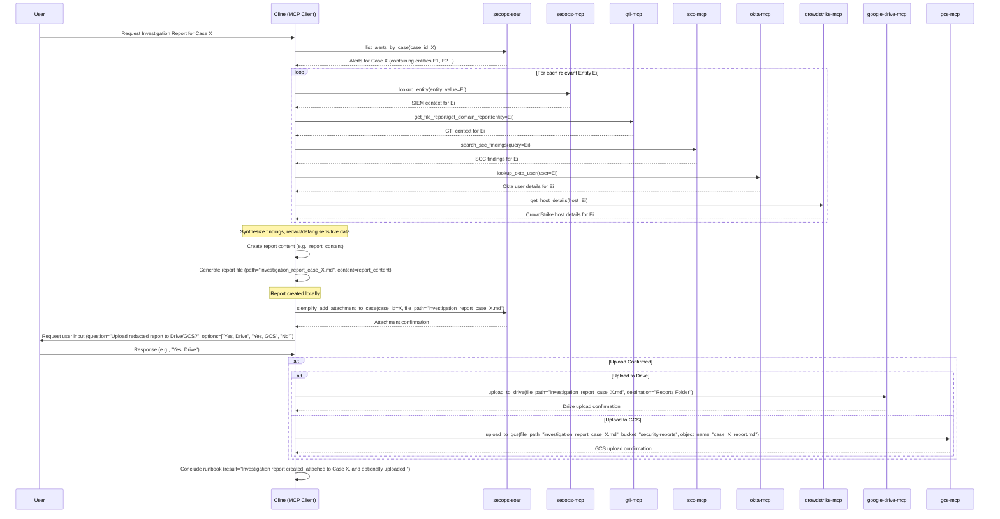

# Runbook: Create Investigation Report

## Objective

Consolidate findings from a completed or ongoing investigation involving various security tools (e.g., SecOps SIEM/SOAR, GTI, SCC, Okta, Crowdstrike) into a comprehensive report suitable for stakeholders or post-incident review. This runbook focuses on the reporting process itself, assuming the core investigation steps have largely been completed.

## Scope

*   **In Scope:** Gathering case context, synthesizing existing findings (from case details, comments, or provided summaries), structuring the report according to templates, generating the report file, attempting to attach it to the SOAR case (with fallback), and optionally handling external uploads.
*   **Out of Scope:** Performing the primary investigation itself (this runbook reports *on* an investigation), deep forensic analysis, executing containment/remediation actions.

## Inputs

*   `${CASE_ID}` (Mandatory): The SOAR case ID for which the report is being generated.
*   *(Optional) `${ALERT_GROUP_IDENTIFIERS}`: Relevant alert group identifiers if needed for specific SOAR actions.*
*   *(Optional) `${INVESTIGATION_SUMMARY}`: Pre-existing summary of findings if available.*
*   *(Optional) `${KEY_ENTITIES}`: List of key entities (users, hosts, IOCs) that were the focus of the investigation.*
*   *(Optional) `${INCLUDE_TOOLS}`: List of tools whose findings should be summarized (e.g., ["SIEM", "GTI", "Okta"]).*
*   *(Optional) `${REPORT_FILENAME_SUFFIX}`: A suffix for the report filename (defaults to `${CASE_ID}`).*

## Tools

**Required for Reporting Workflow:**
*   `secops-soar`: `get_case_full_details`, `post_case_comment`
*   **Action:** Generate report file (e.g., using `write_to_file`)
*   **Action:** Request user input (e.g., using `ask_followup_question`)

**Summarized From (Examples - Actual tools depend on the investigation):**
*   `secops-mcp`: `lookup_entity`, `search_security_events`
*   `gti-mcp`: Various `get_*_report` tools
*   `scc-mcp`: `search_scc_findings`
*   `okta-mcp`: `lookup_okta_user`
*   `crowdstrike-mcp`: `get_host_details`

**Conceptual/Optional (Availability Varies):**
*   `secops-soar`: `siemplify_add_attachment_to_case` (or similar attachment tool)
*   `google-drive-mcp`: `upload_to_drive`
*   `gcs-mcp`: `upload_to_gcs`

## Workflow Steps

1.  **Gather Case Context & Identify Key Entities:** Retrieve full details for `${CASE_ID}` using `secops-soar.get_case_full_details`. Extract relevant alerts, comments, existing entities, priority/status, and **explicitly identify the key entities/IOCs** that are central to the investigation based on this initial context.
2.  **Synthesize Findings:** Combine information from Step 1 with optional inputs (`${INVESTIGATION_SUMMARY}`, `${KEY_ENTITIES}`, `${INCLUDE_TOOLS}`). Review case comments and alert details to reconstruct the investigation narrative and key findings.
    *   **Note on Tool Limitations:** Be aware that direct searches for specific artifacts (like event IDs) or lookups for certain entity types (like hostnames without full paths) might fail or return limited information. If primary methods fail, adapt the investigation by using alternative approaches, such as searching SIEM logs based on related entities (IPs, users) and relevant timeframes, or performing broader lookups.
3.  **Structure Report:** Organize the synthesized information according to standard templates. **Refer to `.clinerules/reporting_templates.md` and `.clinerules/run_books/guidelines/runbook_guidelines.md`**. Key sections should include: Executive Summary, Investigation Timeline (high-level), Involved Entities & Enrichment Summary, Analysis/Root Cause (if determined), Actions Taken (summary), Recommendations/Lessons Learned.
4.  **Generate Mermaid Diagram:** Create a Mermaid sequence diagram summarizing the *actual investigation workflow* performed for this case, including any alternative steps taken or tool failures encountered. The diagram should reflect reality, not just the ideal path.
5.  **Manual Review & Redaction:** **CRITICAL STEP:** Prompt the analyst to review the drafted report content for accuracy and to **manually redact or defang any sensitive data** (e.g., PII, internal hostnames if required, specific credentials) before proceeding. **Request user input** to get confirmation that redaction is complete.
6.  **Format Final Report:** Compile the reviewed/redacted information and the Mermaid diagram into the final Markdown report content.
7.  **Generate report file:** Execute `common_steps/generate_report_file.md` with the final report content, `REPORT_TYPE="investigation_report"`, and `REPORT_NAME_SUFFIX=${CASE_ID}` (or `${REPORT_FILENAME_SUFFIX}`). Obtain `${REPORT_FILE_PATH}` and `${WRITE_STATUS}`.
8.  **Attempt SOAR Attachment:**
    *   *(If `siemplify_add_attachment_to_case` or similar tool exists)* Attempt to attach the generated file (`${REPORT_FILE_PATH}`) to the SOAR case `${CASE_ID}`.
    *   **If Attachment Fails or Tool Unavailable:** Execute `common_steps/document_in_soar.md` with `${CASE_ID}` and `COMMENT_TEXT="Investigation report generated: `${REPORT_FILE_PATH}`. Attachment failed or not available. Summary: [Include brief summary here]."`. Obtain `${COMMENT_POST_STATUS}`.
    *   **If Attachment Succeeds:** Execute `common_steps/document_in_soar.md` with `${CASE_ID}` and `COMMENT_TEXT="Investigation report attached successfully: `${REPORT_FILE_PATH}`."`. Obtain `${COMMENT_POST_STATUS}`.
9.  **Confirm Optional External Upload:** **Request user input** to ask the user: "Upload the redacted report file (`${REPORT_FILE_PATH}`) to Google Drive or GCS?". Options: ["Yes, Drive", "Yes, GCS", "No"]. Obtain `${UPLOAD_CHOICE}`.
10. **Execute External Upload (Optional):**
    *   If `${UPLOAD_CHOICE}` is "Yes, Drive" *(and Drive tool exists)*: Execute `google-drive-mcp.upload_to_drive` with `${REPORT_FILE_PATH}`.
    *   If `${UPLOAD_CHOICE}` is "Yes, GCS" *(and GCS tool exists)*: Execute `gcs-mcp.upload_to_gcs` with `${REPORT_FILE_PATH}`.
    *   Document upload status/location via `common_steps/document_in_soar.md`.
11. **Completion:**
    *   **Action:** Generate a Mermaid sequence diagram summarizing the specific actions taken during this execution.
    *   **Action:** Record the current date and time of execution.
    *   **Action:** (Optional) Record the token usage and runtime duration if available from the environment.
    *   **Conclude runbook** execution.

## Completion Criteria

Investigation findings synthesized, report structured according to guidelines, content reviewed/redacted by analyst, report file generated locally, and SOAR case updated with attachment status or fallback comment. Optional external upload handled if requested and possible.

## Rubric

### 1. Data Synthesis (20 Points)
*   **Context Gathering (10 Points):** Did the agent gather sufficient context from the case?
*   **Synthesis (10 Points):** Did the agent combine findings from multiple tools (SIEM, GTI, etc.)?

### 2. Reporting Workflow (30 Points)
*   **Redaction (10 Points):** Did the agent explicitly prompt for redaction/review?
*   **Attachment (10 Points):** Did the agent attempt to attach the report to the SOAR case?
*   **Upload (10 Points):** Did the agent offer external upload options (if applicable)?

### 3. Visual Summary (10 Points)
*   **Sequence Diagram (10 Points):** Did the agent produce a valid Mermaid sequence diagram summarizing the actions taken during the execution?

### 4. Operational Metadata (10 Points)
*   **Date/Time (5 Points):** Did the agent record the date and time of the execution?
*   **Cost/Runtime (5 Points):** Did the agent attempt to record token usage and runtime duration (or note if unavailable)?

### 5. Resilience & Quality (10 Points)
*   **Error Handling (5 Points):** Did the agent handle any tool failures or invalid inputs gracefully without crashing or hallucinating?
*   **Output Formatting (5 Points):** Is the final output well-structured and free of internal monologue artifacts?

### Critical Failures (Automatic Failure)
*   Skipping the redaction review step.
*   Failing to generate the report file.
*   Uploading sensitive data to external storage without confirmation.
