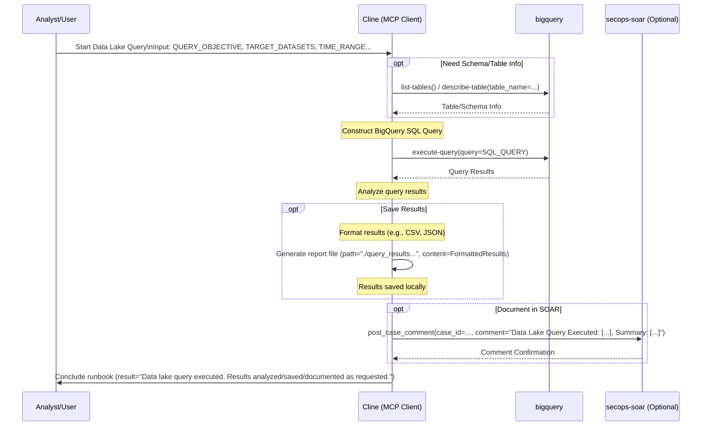

# Runbook: Data Lake Queries

## Objective

To query the security data lake for specific historical data, large-scale analysis, trend identification, or information not readily available via standard SIEM searches. This runbook enables analysts to leverage BigQuery capabilities for deep historical analysis, bulk data processing, and complex analytical queries that exceed normal SIEM limitations in scope or timeframe.

## Scope

Focuses on constructing and executing BigQuery SQL queries against security datasets for historical analysis, bulk operations, and complex data correlation. Covers schema exploration, query optimization, result analysis, and proper data handling procedures. Includes data export capabilities and integration with SOAR documentation. Excludes real-time alerting, streaming analytics, or operational detection use cases - those are handled by SIEM-based runbooks.

## Inputs

*   `${QUERY_OBJECTIVE}`: Description of the data needed or the question to answer.
*   `${TARGET_DATASETS}`: Comma-separated list of BigQuery tables/datasets to query (e.g., `my_project.my_dataset.my_table`).
*   `${TIME_RANGE_START}`: Start timestamp for the query (e.g., ISO 8601 format).
*   `${TIME_RANGE_END}`: End timestamp for the query (e.g., ISO 8601 format).
*   *(Optional) `${SPECIFIC_FIELDS}`: Comma-separated list of specific fields to retrieve.*
*   *(Optional) `${FILTER_CONDITIONS}`: Specific WHERE clause conditions.*

## Tools

*   `bigquery`: `execute-query`, `describe-table`, `list-tables`
*   **Action:** Generate report file (e.g., using `write_to_file`)
*   `secops-soar`: `post_case_comment` (Optional, for documenting query/results)

## Workflow Steps & Diagram

1.  **Define Query:** Based on `${QUERY_OBJECTIVE}`, `${TARGET_DATASETS}`, time range, and filters, construct the BigQuery SQL query. Use `describe-table` or `list-tables` if needed to confirm schema/table names.
2.  **Execute Query:** Run the query using `bigquery.execute-query`.
3.  **Analyze Results:** Review the query results.
4.  **Format/Save Results (Optional):** If needed, format the results and save them to a file using the "Generate report file" action.
5.  **Document (Optional):** Document the query executed and a summary of the results in a relevant SOAR case using `post_case_comment`.

## Completion Criteria

- Query objective clearly defined with specific data requirements identified
- Target datasets and tables verified for existence and appropriate permissions
- SQL query constructed with proper syntax, optimization, and time boundaries
- Schema validation completed to ensure correct field references and data types
- Query executed successfully within reasonable time and resource constraints
- Results analyzed for relevance, accuracy, and completeness
- Large result sets properly handled with pagination or export mechanisms
- Findings summarized with key insights and analytical conclusions
- Results formatted and saved in appropriate format (CSV, JSON, or report)
- Query methodology and results documented in SOAR case if applicable
- Data handling procedures followed for sensitive or classified information
- Query performance metrics captured for optimization recommendations

## Expected Outputs

- **Query Results**: Raw data returned from BigQuery execution
- **Data Analysis Summary**: Key insights and patterns identified from results
- **Exported Data Files**: Formatted result sets saved for further analysis or sharing
- **Query Documentation**: SQL queries used with execution context and parameters
- **Performance Metrics**: Query execution time, data processed, and resource usage
- **SOAR Documentation**: Case comments with query summary and key findings
- **Recommendations**: Suggestions for query optimization or additional analysis
- **Workflow Documentation**: Sequence diagram showing actual MCP tools and servers used during execution
- **Runbook Reference**: Clear identification of which runbook was executed to generate the report
