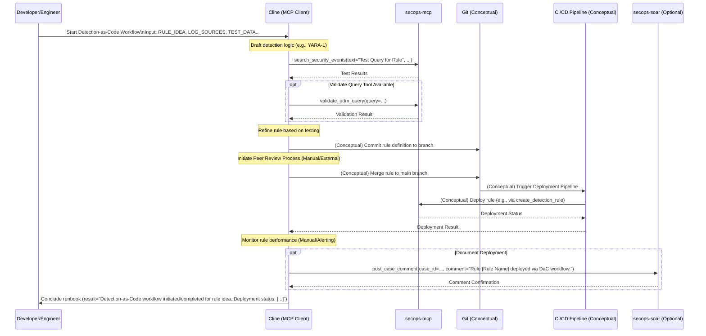

# Runbook: Detection-as-Code Workflows

## Objective

To outline the standardized process for developing, testing, reviewing, and deploying new detection rules using a Detection-as-Code methodology with version control and automated validation. This runbook ensures consistent, high-quality detection rule development that minimizes false positives, maintains documentation standards, and enables collaborative development practices across security teams.

## Scope

Covers rule creation in YARA-L format, testing procedures against historical data, peer review processes, and deployment mechanisms through automated pipelines. Includes rule validation, performance testing, and post-deployment monitoring. Encompasses the complete lifecycle from rule conception through production deployment and ongoing maintenance. Excludes infrastructure setup for CI/CD pipelines, SIEM administration, or detection platform configuration.

## Inputs

*   `${RULE_IDEA}`: Description of the threat or behavior the new rule should detect.
*   `${RELEVANT_LOG_SOURCES}`: Log sources needed for the detection.
*   `${TEST_DATA_LOCATION}`: Location of data suitable for testing the rule.
*   *(Optional) `${VERSION_CONTROL_BRANCH}`: Branch for developing the rule.*

## Tools

*   `secops-mcp`: `search_security_events` (for testing), `validate_udm_query` (if available), `list_security_rules` (to check existing rules)
*   *(Potentially Version Control tools like Git if integrated via MCP)*
*   *(Potentially CI/CD pipeline tools if integrated via MCP)*
*   *(Potentially rule deployment tools if available via MCP, e.g., `create_detection_rule`)*
*   `secops-soar`: `post_case_comment` (for tracking/review)

## Workflow Steps & Diagram

1.  **Rule Development:** Draft the detection logic based on `${RULE_IDEA}` and `${RELEVANT_LOG_SOURCES}`.
2.  **Testing:** Test the rule logic against `${TEST_DATA_LOCATION}` using `search_security_events` or other methods. Validate syntax (e.g., `validate_udm_query`).
3.  **Version Control:** Commit the rule definition to the appropriate `${VERSION_CONTROL_BRANCH}`.
4.  **Peer Review:** Initiate a code review process for the new rule.
5.  **Deployment:** Merge the rule to the main branch and trigger the deployment pipeline (or manually deploy using appropriate tools like `create_detection_rule`).
6.  **Monitoring:** Monitor the rule's performance post-deployment.
7.  **Completion:**
    *   **Action:** Generate a Mermaid sequence diagram summarizing the specific actions taken during this execution.
    *   **Action:** Record the current date and time of execution.
    *   **Action:** (Optional) Record the token usage and runtime duration if available from the environment.
    *   Conclude the runbook execution.

## Completion Criteria

- Detection rule logic developed based on threat requirements and log source analysis
- Rule syntax validated using available SIEM tools and validation frameworks
- Testing completed against historical data with documented true/false positive rates
- Rule performance metrics captured including execution time and resource usage
- Peer review process completed with security team approval and documentation
- Version control integration completed with proper branching and merge procedures
- Rule deployed to production environment through automated deployment pipeline
- Post-deployment monitoring configured with appropriate alerting thresholds
- Rule documentation updated including detection logic, test results, and maintenance notes
- Performance baseline established for ongoing tuning and optimization
- Rollback procedures tested and documented for emergency rule disabling

## Expected Outputs

- **Detection Rule**: Validated YARA-L rule ready for production deployment
- **Test Results**: Comprehensive validation report including performance metrics
- **Documentation**: Rule logic explanation, maintenance notes, and troubleshooting guide
- **Version Control**: Rule stored in repository with proper versioning and metadata
- **Deployment Record**: Tracking of rule deployment status and configuration
- **Monitoring Dashboard**: Performance metrics and alerting configuration
- **Peer Review Record**: Documentation of review process and approval decisions
- **Rollback Plan**: Procedures for emergency rule disabling or modification
- **Workflow Documentation**: Sequence diagram showing actual MCP tools and servers used during execution
- **Runbook Reference**: Clear identification of which runbook was executed to generate the report

## Rubric

### 1. Rule Development (20 Points)
*   **Logic Creation (10 Points):** Did the agent draft reasonable detection logic based on the input?
*   **Syntax Check (10 Points):** Did the agent attempt to validate the query syntax (if tools available)?

### 2. Testing (30 Points)
*   **Query Execution (15 Points):** Did the agent test the rule against historical data?
*   **Result Analysis (15 Points):** Did the agent analyze the test results (e.g., volume, false positives)?

### 3. Pipeline Integration (20 Points)
*   **Commit/Merge (10 Points):** Did the agent simulate or perform the version control steps?
*   **Documentation (10 Points):** Did the agent document the deployment/testing status?

### 4. Visual Summary (10 Points)
*   **Sequence Diagram (10 Points):** Did the agent produce a valid Mermaid sequence diagram summarizing the actions taken during the execution?

### 5. Operational Metadata (10 Points)
*   **Date/Time (5 Points):** Did the agent record the date and time of the execution?
*   **Cost/Runtime (5 Points):** Did the agent attempt to record token usage and runtime duration (or note if unavailable)?

### 6. Resilience & Quality (10 Points)
*   **Error Handling (5 Points):** Did the agent handle any tool failures or invalid inputs gracefully without crashing or hallucinating?
*   **Output Formatting (5 Points):** Is the final output well-structured and free of internal monologue artifacts?

### Critical Failures (Automatic Failure)
*   Deploying a rule without testing it.
*   Ignoring syntax errors in the detection logic.
*   Failing to document the rule's purpose.
