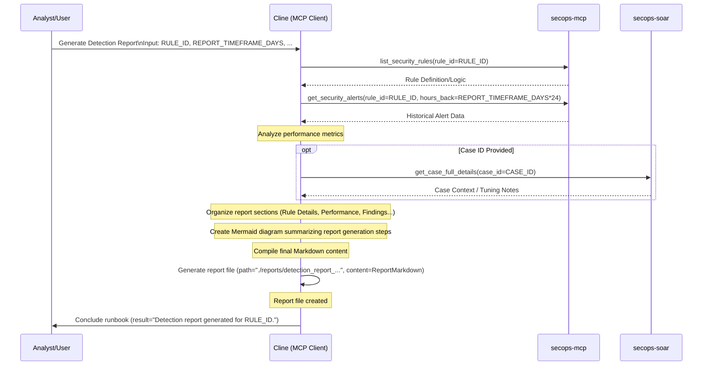

# Runbook: Generate Detection Report

## Objective

To summarize the findings, logic, and performance of a specific detection rule or set of related rules for review, tuning documentation, management reporting, or detection capability assessment. This runbook creates comprehensive reports that capture rule effectiveness, performance metrics, tuning history, and recommendations for optimization or retirement.

## Scope

Focuses on analyzing existing information about detection rules including alert volume, true/false positive rates, coverage analysis, and performance metrics. Includes correlation with SOAR case outcomes to assess rule effectiveness. May include data from recent validation or tuning efforts but doesn't typically involve executing new validation steps. Excludes rule development or modification activities - those are covered by Detection-as-Code workflows.

## Inputs

*   `${RULE_ID}` or `${RULE_IDS}`: The identifier(s) of the detection rule(s) to report on.
*   *(Optional) `${REPORT_TIMEFRAME_DAYS}`: Timeframe for performance data (e.g., 90).*
*   *(Optional) `${CASE_ID}`: Relevant SOAR case ID if the report relates to a specific incident or tuning effort.*

## Tools

*   `secops-mcp`: `list_security_rules`, `get_security_alerts` (for performance data)
*   `secops-soar`: `get_case_full_details`, `post_case_comment` (for context/documentation)
*   **Action:** Generate report file (e.g., using `write_to_file`)

## Workflow Steps & Diagram

1.  **Gather Rule Details:** Retrieve the rule logic/definition for `${RULE_ID}` using `list_security_rules`.
2.  **Gather Performance Data:** Retrieve historical alerts generated by the rule over `${REPORT_TIMEFRAME_DAYS}` using `get_security_alerts`. Analyze volume, severity, and potentially associated case statuses (TP/FP).
3.  **Gather Context:** Review related SOAR cases (`${CASE_ID}`) or tuning documentation if applicable.
4.  **Structure Report:** Organize information according to a standard template (referencing `.clinerules/reporting_templates.md`). Key sections might include: Rule Details (ID, Name, Logic Summary), Performance Metrics (Alert Volume, TP/FP Ratio if known), Key Findings/Observations, Tuning History/Recommendations (if applicable).
5.  **Generate Mermaid Diagram:** Create a Mermaid sequence diagram summarizing the *tools used to gather data for this report*.
6.  **Format Report:** Compile the synthesized information and the Mermaid diagram into a final Markdown report.
7.  **Generate report file:** Save the report with a standardized name (e.g., `./reports/detection_report_${RULE_ID}_${timestamp}.md`).
8.  **Completion:**
    *   **Action:** Generate a Mermaid sequence diagram summarizing the specific actions taken during this execution.
    *   **Action:** Record the current date and time of execution.
    *   **Action:** (Optional) Record the token usage and runtime duration if available from the environment.
    *   Conclude the runbook execution.

## Completion Criteria

- Rule definition and logic clearly documented with implementation details
- Historical performance data gathered for specified timeframe with alert volumes
- True positive/false positive analysis completed based on SOAR case outcomes
- Alert distribution analysis completed showing trends and patterns over time
- Rule effectiveness metrics calculated including detection rate and accuracy
- Coverage analysis performed identifying protected and unprotected attack vectors
- Tuning history documented with changes made and rationale for modifications
- Performance impact assessment completed including resource usage and execution time
- Comparative analysis performed against similar rules or detection capabilities
- Recommendations formulated for rule optimization, retirement, or enhancement
- Report formatted in standardized template with executive summary and technical details
- Visual representations created for key metrics and trends using appropriate diagrams

## Expected Outputs

- **Detection Analysis Report**: Comprehensive report file saved in standardized format
- **Performance Metrics**: Alert volume, TP/FP rates, execution time, and resource usage
- **Effectiveness Assessment**: Coverage analysis and detection capability evaluation
- **Trend Analysis**: Historical patterns and alert distribution over specified timeframe
- **Tuning Recommendations**: Specific suggestions for rule optimization or modification
- **Executive Summary**: High-level overview suitable for management consumption
- **Technical Details**: Rule logic, implementation specifics, and configuration parameters
- **Comparative Analysis**: Benchmarking against similar rules or industry standards
- **Workflow Documentation**: Sequence diagram showing actual MCP tools and servers used during execution
- **Runbook Reference**: Clear identification of which runbook was executed to generate the report

## Rubric

### 1. Data Gathering (20 Points)
*   **Logic Retrieval (10 Points):** Did the agent retrieve the rule definition?
*   **Performance Data (10 Points):** Did the agent gather historical alert data?

### 2. Analysis (20 Points)
*   **Metric Analysis (10 Points):** Did the agent analyze alert volume and TP/FP trends?
*   **Effectiveness (10 Points):** Did the agent assess rule effectiveness based on the data?

### 3. Reporting (20 Points)
*   **Format (10 Points):** Did the agent use the standard reporting template?
*   **Recommendations (10 Points):** Did the agent provide tuning or optimization recommendations?

### 4. Visual Summary (10 Points)
*   **Sequence Diagram (10 Points):** Did the agent produce a valid Mermaid sequence diagram summarizing the actions taken during the execution?

### 5. Operational Metadata (10 Points)
*   **Date/Time (5 Points):** Did the agent record the date and time of the execution?
*   **Cost/Runtime (5 Points):** Did the agent attempt to record token usage and runtime duration (or note if unavailable)?

### 6. Resilience & Quality (10 Points)
*   **Error Handling (5 Points):** Did the agent handle any tool failures or invalid inputs gracefully without crashing or hallucinating?
*   **Output Formatting (5 Points):** Is the final output well-structured and free of internal monologue artifacts?

### Critical Failures (Automatic Failure)
*   Failing to retrieve historical data.
*   Generating a report with empty metrics sections.
*   Reporting on the wrong Rule ID.
