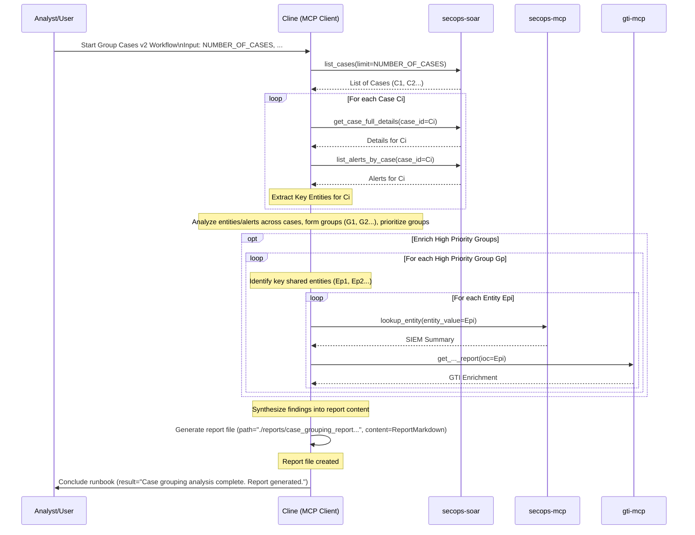

# Runbook: Group Cases v2 - Enhanced Workflow (Placeholder)

## Status Note

**This is a placeholder for an enhanced version of the Group Cases workflow.** 

**Current Active Version**: Use `group_cases.md` for operational workflows.  
**Future Enhancement**: This v2 will provide improved grouping algorithms, enhanced automation, and streamlined reporting.

## Objective

To provide an enhanced workflow for analyzing recent SOAR cases with improved grouping logic, automated prioritization algorithms, and advanced entity correlation capabilities that extend beyond the current `group_cases.md` implementation.

## Scope

*(Define what is included/excluded, e.g., Focuses on analyzing existing case data and alerts. May involve basic enrichment but not deep investigation of each case.)*

## Inputs

*   *(Optional) `${NUMBER_OF_CASES}`: Number of recent cases to analyze (e.g., 5, 10).*
*   *(Optional) `${TIME_FRAME_HOURS}`: Lookback period for cases.*
*   *(Optional) `${GROUPING_CRITERIA}`: Specific criteria for grouping (e.g., shared hostname, alert type, CVE).*

## Tools

*   `secops-soar`: `list_cases`, `get_case_full_details`, `list_alerts_by_case`, `get_entities_by_alert_group_identifiers`
*   `secops-mcp`: `lookup_entity`
*   `gti-mcp`: (Relevant enrichment tools)
*   **Action:** Generate report file (e.g., using `write_to_file`)

## Workflow Steps & Diagram

1.  **List Cases:** Retrieve recent cases using `list_cases`.
2.  **Gather Case Details:** For each case, get details using `get_case_full_details` and `list_alerts_by_case`. Extract key entities.
3.  **Group Cases:** Analyze entities and alert details across cases to identify logical groups based on `${GROUPING_CRITERIA}` or observed similarities.
4.  **Prioritize Groups:** Assess the priority of each group based on alert severity, entity criticality, or potential impact.
5.  **Enrich Key Entities (Optional):** Perform basic enrichment on key shared entities within high-priority groups using `lookup_entity` and GTI tools.
6.  **Generate Summary Report:** Create a report summarizing the case groups, prioritization rationale, and key findings using the "Generate report file" action.

## Completion Criteria

*(Define how successful completion is determined, e.g., Cases analyzed, groups identified and prioritized, summary report generated.)*

## Runbook Conclusion
*   **Action:** Generate a Mermaid sequence diagram summarizing the specific actions taken during this execution.
*   **Action:** Record the current date and time of execution.
*   **Action:** (Optional) Record the token usage and runtime duration if available from the environment.
*   Conclude the runbook execution.

## Rubric

### 1. Grouping Strategy (20 Points)
*   **Case Retrieval (10 Points):** Did the agent list and retrieve details for the recent cases?
*   **Grouping Logic (10 Points):** Did the agent apply a logical grouping strategy (e.g., by alert type, entity)?

### 2. Analysis & Prioritization (30 Points)
*   **Prioritization (15 Points):** Did the agent prioritize the groups based on severity/risk?
*   **Enrichment (15 Points):** Did the agent enrich key entities within high-priority groups?

### 3. Reporting (20 Points)
*   **Report Generation (10 Points):** Did the agent generate a Markdown report summarizing the findings?
*   **Content Quality (10 Points):** Does the report clearly explain the grouping and prioritization rationale?

### 4. Visual Summary (10 Points)
*   **Sequence Diagram (10 Points):** Did the agent produce a valid Mermaid sequence diagram summarizing the actions taken during the execution?

### 5. Operational Metadata (10 Points)
*   **Date/Time (5 Points):** Did the agent record the date and time of the execution?
*   **Cost/Runtime (5 Points):** Did the agent attempt to record token usage and runtime duration (or note if unavailable)?

### 6. Resilience & Quality (10 Points)
*   **Error Handling (5 Points):** Did the agent handle any tool failures or invalid inputs gracefully without crashing or hallucinating?
*   **Output Formatting (5 Points):** Is the final output well-structured and free of internal monologue artifacts?

### Critical Failures (Automatic Failure)
*   Failing to retrieve case details before grouping.
*   Generating a report with no actionable insights.
*   Hallucinating connections between unrelated cases.
