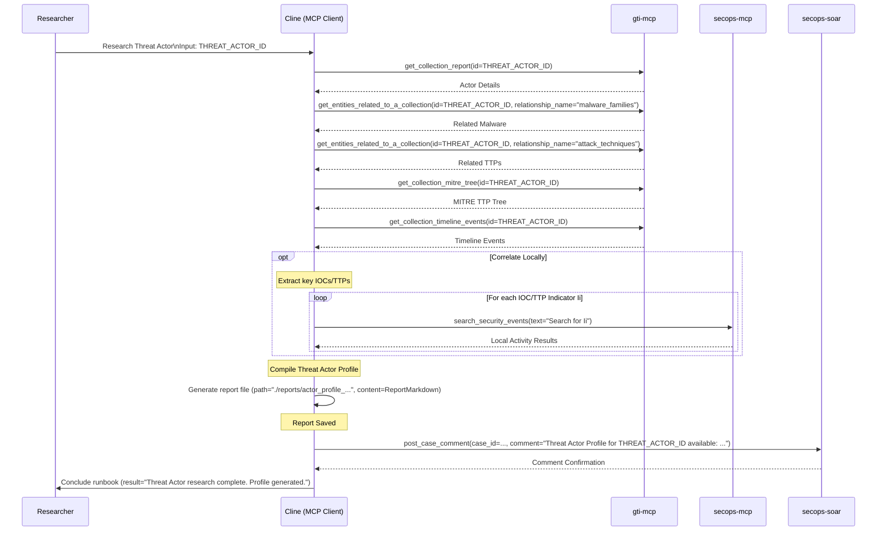

# Runbook: Threat Intelligence Workflows

## Objective

To outline standardized workflows for Cyber Threat Intelligence (CTI) researchers and analysts covering common intelligence tasks such as researching threat actors, analyzing malware families, campaign tracking, and intelligence dissemination. This runbook provides structured approaches for intelligence collection, analysis, and distribution using available threat intelligence platforms and tools.

## Scope

Covers typical CTI tasks using GTI, SIEM, and SOAR tools including threat actor research, malware analysis, campaign correlation, and intelligence product creation. Includes methodologies for intelligence collection, validation, analysis, and dissemination. May reference specific hunting or analysis runbooks for detailed technical procedures. Excludes intelligence platform administration, OSINT collection from unstructured sources, or strategic intelligence assessment.

## Inputs

*   `${THREAT_ACTOR_ID}`: Identifier for threat actor research workflows
*   `${MALWARE_FAMILY}`: Malware family name for analysis workflows
*   `${CAMPAIGN_NAME}`: Campaign identifier for tracking and analysis
*   `${IOC_VALUE}`: Specific indicator for pivoting and enrichment
*   `${GTI_COLLECTION_ID}`: GTI collection identifier for detailed analysis
*   `${INTELLIGENCE_REQUIREMENT}`: Specific intelligence question or priority information requirement
*   `${TIMEFRAME}`: Analysis timeframe for temporal correlation and trending
*   `${DISTRIBUTION_LIST}`: Target audience for intelligence dissemination

## Tools

*   `gti-mcp`: (List relevant tools, likely most of them)
*   `secops-mcp`: `search_security_events`, `lookup_entity`, `get_ioc_matches`
*   `secops-soar`: `post_case_comment`, `list_cases`, `siemplify_add_general_insight`
*   **Action:** Generate report file (e.g., using `write_to_file`)
*   *(External OSINT tools/feeds - Manual)*

## Workflow Steps & Diagram

*(This section would outline common CTI processes, potentially branching based on the type of intelligence task.)*

**Example Workflow: Researching a Threat Actor**

1.  **Receive Input:** Obtain Threat Actor Name or ID (`${THREAT_ACTOR_ID}`).
2.  **Initial GTI Lookup:** Use `gti-mcp.search_threat_actors` or `gti-mcp.get_collection_report`.
3.  **Explore Relationships:** Use `gti-mcp.get_entities_related_to_a_collection` to find associated malware, campaigns, TTPs, IOCs.
4.  **Analyze TTPs:** Use `gti-mcp.get_collection_mitre_tree`.
5.  **Review Timelines:** Use `gti-mcp.get_collection_timeline_events`.
6.  **Correlate Locally (Optional):** Use `secops-mcp` tools (`search_security_events`, `lookup_entity`) to search for related IOCs/TTPs in the environment.
7.  **Synthesize & Report:** Compile findings into a threat actor profile using the "Generate report file" action.
8.  **Disseminate:** Share findings via `secops-soar.post_case_comment` or other channels.

## Completion Criteria

- Intelligence requirement clearly defined with specific objectives and scope
- Relevant threat intelligence sources identified and accessed using appropriate tools
- Data collection completed from GTI and correlated with internal SIEM data
- Threat actor, malware, or campaign analysis performed using structured methodologies
- Relationships and associations mapped between entities, TTPs, and infrastructure
- Timeline analysis completed showing evolution and development of threats
- Local correlation performed to identify potential organizational exposure or impact
- Intelligence findings validated through multiple sources and cross-references
- Analytical products created following standard intelligence reporting formats
- Intelligence disseminated to appropriate stakeholders through designated channels
- Recommendations formulated for defensive measures, detection improvements, or further research
- Intelligence database updated with new findings and analytical conclusions

## Expected Outputs

- **Intelligence Report**: Structured analysis document with findings and recommendations
- **Threat Actor Profile**: Comprehensive assessment of capabilities, infrastructure, and TTPs
- **Malware Analysis**: Technical and behavioral analysis with detection recommendations
- **Campaign Tracking**: Timeline and evolution analysis with attribution assessment
- **IOC Package**: Validated indicators with context and confidence ratings
- **SIEM Correlation**: Results of local environment searches and potential impact assessment
- **Intelligence Briefing**: Executive summary suitable for leadership and stakeholder consumption
- **Database Updates**: Enhanced threat intelligence platform records with new analytical insights
- **Workflow Documentation**: Sequence diagram showing actual MCP tools and servers used during execution
- **Runbook Reference**: Clear identification of which runbook was executed to generate the report
