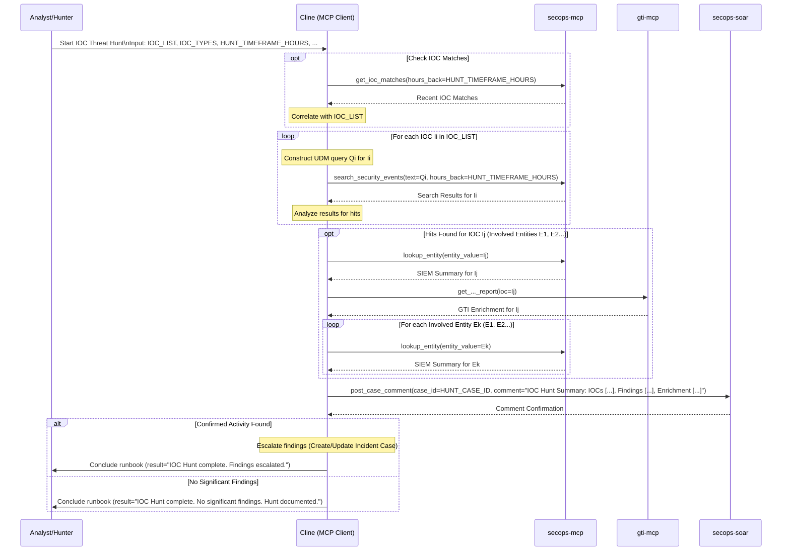

# Runbook: IOC Threat Hunt

## Objective

To proactively hunt for specific Indicators of Compromise (IOCs) across the environment based on threat intelligence feeds, recent incidents, emerging threats, or specific hypotheses. This runbook enables systematic searching for known bad indicators to identify potential compromise, lateral movement, or persistence mechanisms that may have evaded detection rules.

## Scope

Focuses on searching SIEM and data lake sources for specific IOC values (IPs, domains, file hashes, URLs) using targeted queries optimized for each IOC type. Includes basic enrichment of findings, correlation with existing cases, and escalation procedures for confirmed hits. Covers multiple IOC types in a single hunt session and provides comprehensive documentation of hunt methodology and results. Excludes hypothesis-driven hunting or advanced analytics - those are covered by specialized threat hunting runbooks.

## Inputs

*   `${IOC_LIST}`: Comma-separated list of IOC values to hunt for.
*   `${IOC_TYPES}`: Corresponding comma-separated list of IOC types (e.g., "IP Address, Domain, File Hash").
*   `${HUNT_TIMEFRAME_HOURS}`: Lookback period in hours (e.g., 72, 168).
*   *(Optional) `${HUNT_CASE_ID}`: SOAR case ID for tracking.*
*   *(Optional) `${REASON_FOR_HUNT}`: Brief description why these IOCs are being hunted.*

## Tools

*   `secops-mcp`: `search_security_events`, `lookup_entity`, `get_ioc_matches`
*   `gti-mcp`: (Relevant enrichment tools like `get_ip_address_report`, `get_domain_report`, etc.)
*   `secops-soar`: `post_case_comment` (for documenting hunt/findings)

## Workflow Steps & Diagram

1.  **Receive Inputs:** Obtain `${IOC_LIST}`, `${IOC_TYPES}`, `${HUNT_TIMEFRAME_HOURS}`, etc.
2.  **Initial Check (Optional):** Use `secops-mcp.get_ioc_matches` to see if any IOCs in the list have recent matches in the SIEM's integrated feeds.
3.  **Iterative SIEM Search:**
    *   For each IOC in `${IOC_LIST}`:
        *   Construct appropriate UDM queries for `secops-mcp.search_security_events` based on the IOC value and type.
        *   Execute the search over `${HUNT_TIMEFRAME_HOURS}`.
        *   Analyze results for any hits (e.g., network connections, file executions, DNS lookups).
4.  **Enrich Findings:**
    *   If hits are found for an IOC:
        *   Use `secops-mcp.lookup_entity` for the IOC and any involved entities (hosts, users).
        *   Use relevant `gti-mcp` tools to enrich the IOC itself.
5.  **Document Hunt & Findings:**
    *   Use `secops-soar.post_case_comment` in `${HUNT_CASE_ID}` (if provided) or a dedicated hunt case.
    *   Document: IOCs Hunted, Timeframe, Queries Used, Summary of Findings (including IOCs with no hits), Details of any confirmed hits and enrichment data.
6.  **Escalate or Conclude:**
    *   If confirmed malicious activity related to the hunted IOCs is found, escalate by creating/updating an incident case.
    *   If no significant findings, conclude the hunt and document it.

## Completion Criteria

- All provided IOCs searched across specified timeframe using appropriate UDM queries
- IOC match check completed against integrated threat intelligence feeds
- Search results analyzed for legitimate vs. suspicious activity patterns
- Any hits enriched using GTI and SIEM entity lookup capabilities
- Involved entities (hosts, users, processes) identified and assessed for impact
- Correlation performed with existing open cases and previous incidents
- Hunt findings documented in SOAR with detailed methodology and results
- Confirmed malicious activity escalated to incident response processes
- Hunt summary includes both positive and negative results for intelligence value
- IOCs with no hits documented to confirm environment is clean
- Recommendations provided for detection rule improvements or monitoring gaps

## Expected Outputs

- **Hunt Results Summary**: Comprehensive overview of all IOCs searched and findings
- **Hit Analysis**: Detailed breakdown of any confirmed IOC matches with context
- **Entity Impact Assessment**: Analysis of compromised or affected systems/users
- **Timeline Reconstruction**: Sequence of events for any confirmed malicious activity
- **SOAR Documentation**: Case comments with complete hunt methodology and findings
- **Escalation Actions**: Incident cases created or updated for confirmed threats
- **Clean IOCs List**: Documentation of IOCs with no environmental presence
- **Detection Gaps**: Recommendations for improved monitoring or detection rules
- **Workflow Documentation**: Sequence diagram showing actual MCP tools and servers used during execution
- **Runbook Reference**: Clear identification of which runbook was executed to generate the report
