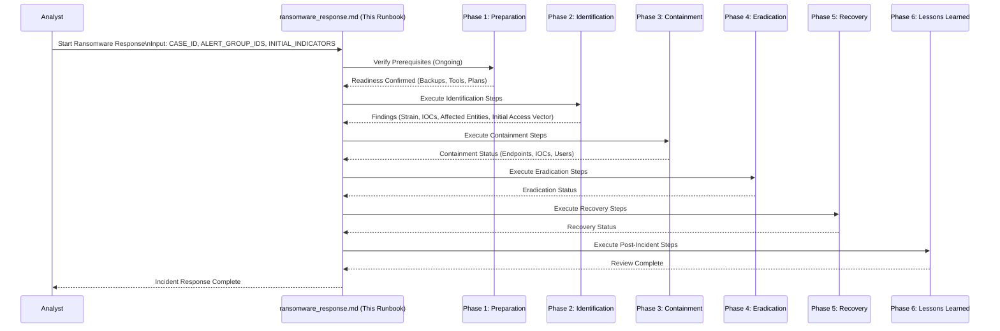

# Ransomware Incident Response Plan (IRP) / Runbook

## Objective

Provide a structured workflow for responding to suspected ransomware incidents, coordinating investigation, containment, eradication, and recovery efforts using available tools and procedures. This runbook orchestrates various specialized runbooks.

## Scope

This runbook covers the end-to-end response lifecycle for ransomware incidents, from initial detection to post-incident review. It relies on specific sub-runbooks for detailed execution steps.

## Phases (PICERL Model)

1.  **Preparation:** *(Ongoing)* Ensure tools are operational, backups are tested, relevant detections are active, and communication/escalation plans are clear.
2.  **Identification:** Detect the incident, perform initial triage, identify the ransomware strain, determine initial scope, and investigate initial access/lateral movement.
3.  **Containment:** Limit the scope and magnitude of the incident by isolating affected systems and blocking malicious network IOCs.
4.  **Eradication:** Remove the ransomware and any associated persistence mechanisms.
5.  **Recovery:** Restore affected systems to normal operation safely, potentially using backups or decryptors.
6.  **Lessons Learned (Post-Incident):** Review the incident and response to identify improvements.

## Inputs

*   `${CASE_ID}`: The SOAR case ID created for or associated with the initial alert(s).
*   `${ALERT_GROUP_IDENTIFIERS}`: Relevant alert group identifiers from the SOAR case.
*   `${INITIAL_INDICATORS}`: Information about the initial detection, which could include:
    *   Alert details (e.g., EDR detection name, SIEM rule).
    *   Affected endpoint(s) (`ENDPOINT_ID`, `ENDPOINT_TYPE`).
    *   Observed file hashes (`FILE_HASH`).
    *   Ransom note details (file names, contact info - **handle with care**).
    *   Observed suspicious network connections (IPs/Domains).

## Tools

*   `gti-mcp`: `get_file_report`, `search_threats` (querying ransomware name/family), `get_collection_report` (for known families/actors).
*   `secops-mcp`: `search_security_events`, `lookup_entity`.
*   `secops-soar`: `post_case_comment`, `get_case_full_details`.
*   **Basic Endpoint Triage & Isolation Runbook:** `../basic_endpoint_triage_isolation.md` (Crucial for containment).
*   **IOC Containment Runbook:** `../ioc_containment.md` (For network IOCs).
*   **Compromised User Account Response Runbook:** `../compromised_user_account_response.md` (If initial access vector involves user).
*   **Action:** Request user input (e.g., using `ask_followup_question` to confirm actions, especially isolation)
*   *(External Resources: Ransomware identification sites, known decryptor databases - manual step)*.
*   **Common Steps:** `common_steps/check_duplicate_cases.md`, `common_steps/find_relevant_soar_case.md`, `common_steps/document_in_soar.md`, `common_steps/todo_list_generation.md`

## Workflow Steps & Diagram

---

### Phase 1: Preparation (Ongoing)

*   **Objective:** Ensure readiness to respond to ransomware incidents.
*   **Actions:**
    *   Verify tool connectivity.
    *   Ensure regular, tested backups of critical systems exist.
    *   Maintain asset inventory and network diagrams.
    *   Ensure relevant detections for ransomware precursors (e.g., credential dumping, lateral movement tools, specific exploits) and known ransomware IOCs are active.
    *   Review and understand communication, escalation (`.clinerules/escalation_paths.md`), and potentially ransom payment decision-making procedures.

---

### Phase 2: Identification

*   **Objective:** Detect the incident, identify the ransomware strain, determine initial scope, and investigate initial access/lateral movement.
*   **Sub-Runbooks/Steps:**
    1.  **Receive Input & Context:** Obtain initial indicators, `${CASE_ID}`, `${ALERT_GROUP_IDENTIFIERS}`. Get case details via `secops-soar.get_case_full_details`. Check for duplicates (`../common_steps/check_duplicate_cases.md`).
    2.  **Create Investigation Todo List:** Given the complexity of ransomware response, create a comprehensive todo list following `../common_steps/todo_list_generation.md`. Include all PICERL phases and track progress throughout the incident. Display the initial todo list to the analyst for visibility.
    3.  **Identify Ransomware Strain:**
        *   If a file hash (`${FILE_HASH}`) is available, use `gti-mcp.get_file_report` to identify the malware family/ransomware name.
        *   If EDR alert name or ransom note details provide a name, use `gti-mcp.search_threats` (e.g., `query="LockBit ransomware" collection_type:"malware-family"`) or `get_collection_report` if a specific GTI ID is known.
        *   *(Manual Step: Use external resources like ID Ransomware if GTI doesn't yield results).*
        *   Document the identified (or suspected) strain (`IDENTIFIED_STRAIN`).
    4.  **Investigate Initial Access & Lateral Movement (SIEM):**
        *   Use `secops-mcp.search_security_events` focusing on the time *before* and *during* the initial encryption activity on the affected endpoints:
            *   Search for suspicious logins, RDP activity, or exploit attempts targeting the initially affected endpoints.
            *   Search for execution of suspicious tools (PsExec, Cobalt Strike beacons, etc.).
            *   Search for activity related to the user logged into the endpoint at the time of infection (potentially trigger `../compromised_user_account_response.md`).
            *   Trace network connections *from* the affected endpoints to identify potential lateral movement targets.
        *   Identify potential initial access vector (`INITIAL_ACCESS_VECTOR`) and other potentially affected systems (`POTENTIAL_ADDITIONAL_SYSTEMS`).
    5.  **Initial Scope Assessment:**
        *   Combine initial indicators with findings from step 3 to create a list of initially identified affected endpoints (`AFFECTED_ENDPOINTS`) and potentially malicious network IOCs (`MALICIOUS_IOCs`).
    6.  **Check Related SOAR Cases:**
        *   Prepare list of key entities: `SEARCH_TERMS = AFFECTED_ENDPOINTS + MALICIOUS_IOCs`.
        *   Execute `../common_steps/find_relevant_soar_case.md` with `SEARCH_TERMS` and `CASE_STATUS_FILTER="Opened"`.
        *   Obtain `${RELATED_SOAR_CASES}` (list of potentially relevant open case summaries/IDs).
    7.  **Document Identification Phase:**
        *   Document findings (`IDENTIFIED_STRAIN`, `INITIAL_ACCESS_VECTOR`, `AFFECTED_ENDPOINTS`, `MALICIOUS_IOCs`, `${RELATED_SOAR_CASES}`) using `../common_steps/document_in_soar.md`.

---

### Phase 3: Containment

*   **Objective:** Prevent the ransomware from spreading further and stop ongoing malicious activity.
*   **Sub-Runbooks/Steps:**
    1.  **Isolate Affected Endpoints:**
        *   For each endpoint in `AFFECTED_ENDPOINTS` and `POTENTIAL_ADDITIONAL_SYSTEMS`:
            *   Execute `../basic_endpoint_triage_isolation.md`. **Prioritize immediate isolation confirmation with analyst.**
    2.  **Contain Network IOCs:**
        *   For each IOC in `MALICIOUS_IOCs`:
            *   Execute `../ioc_containment.md`. **Confirm containment action with analyst.**
    3.  **Contain User Accounts (If Applicable):**
        *   If `INITIAL_ACCESS_VECTOR` involved a compromised user, ensure containment actions were taken via `../compromised_user_account_response.md`.
    4.  **Verify Containment:**
        *   Monitor SIEM (`secops-mcp.search_security_events`) for further encryption activity, C2 communication, or lateral movement attempts from contained systems/IOCs.
        *   Document containment status using `../common_steps/document_in_soar.md`.

---

### Phase 4: Eradication

*   **Objective:** Remove the ransomware and any associated persistence mechanisms from affected systems.
*   **Sub-Runbooks/Steps:**
    1.  **Identify Persistence:**
        *   Analyze findings from Phase 2 (GTI reports for the strain, SIEM searches) to identify known persistence TTPs for `IDENTIFIED_STRAIN`.
        *   *(Requires EDR/Forensic tools)* Examine contained endpoints for specific persistence artifacts (scheduled tasks, services, registry keys, malicious processes).
    2.  **Remove Ransomware & Persistence:**
        *   *(Requires specific EDR/Endpoint Management tools or manual intervention)*
        *   Execute plan to remove ransomware executables, associated files, and persistence mechanisms from contained endpoints. **Note:** Re-imaging (Phase 5) is often preferred over cleaning for ransomware.
    3.  **Scan for Residual Infection:**
        *   *(Requires EDR/AV tools)*
        *   Perform thorough scans on affected systems post-eradication attempts (if cleaning was attempted).
    4.  **Document Eradication:**
        *   Document actions taken and scan results using `../common_steps/document_in_soar.md`.

---

### Phase 5: Recovery

*   **Objective:** Restore affected systems to normal operation safely.
*   **Sub-Runbooks/Steps:** *(Placeholder - Requires dedicated Recovery Runbook)*
    1.  **Check Decryptor Availability:** Based on `IDENTIFIED_STRAIN`, check known decryptor availability *(Manual Step: NoMoreRansom.org, vendor sites)*.
    2.  **Determine Recovery Strategy:** Decide whether to rebuild systems from known-good backups (most common for ransomware) or attempt decryption/cleaning. Consider backup integrity and age.
    3.  **Rebuild/Recover Systems:** Execute the chosen strategy. *(Likely involves IT Ops/System Admins)*.
    4.  **Patch & Harden:** Ensure recovered/rebuilt systems are fully patched and hardened before reconnecting. Perform vulnerability scans (`scc-mcp` or other tools).
    5.  **Restore Data:** Restore data from clean backups. Validate data integrity.
    6.  **Monitor Systems:** Closely monitor recovered systems for any signs of residual infection or abnormal behavior using SIEM/EDR.
    7.  **Lift Containment:** Gradually remove isolation measures once confidence in recovery is high.
    8.  **Document Recovery:** Document steps taken using `../common_steps/document_in_soar.md`.

---

### Phase 6: Lessons Learned (Post-Incident)

*   **Objective:** Review the incident and response to identify areas for improvement.
*   **Sub-Runbooks/Steps:**
    1.  **Update Todo List:** Display final todo list status showing all completed tasks and any remaining items. Calculate and report overall completion percentage. This provides an audit trail of the response activities.
    2.  **Generate Incident Report:** Execute `../common_steps/generate_report_file.md` with comprehensive ransomware incident findings, strain analysis, response timeline, containment actions, recovery results, and initial analysis using guidelines from `.clinerules/reporting_templates.md` and `../report_writing.md`. Include the todo list tracking information in the report methodology section.
    3.  **Conduct Post-Incident Review:** Execute `../post_incident_review.md` with `${CASE_ID}` and the generated incident report, including:
        *   **Incident Review Meeting:** Conduct a post-mortem meeting. Discuss initial access, spread, impact, response effectiveness, recovery success.
        *   **Analyze Response:** Review timeline, tool effectiveness, runbook adherence.
        *   **Identify Gaps:** Focus on prevention (how did it get in?), detection (was it detected quickly?), and response gaps.
        *   **Develop Recommendations:** Suggest improvements (e.g., security control changes, new detections, backup strategy review, user training).
        *   **Update Documentation:** Update runbooks, policies, etc.
        *   **Track Recommendations:** Assign and track implementation.
    4.  **Document Review:** Document PIR outcomes using `../common_steps/document_in_soar.md`.

---

### Phase 7: Lessons Learned / Runbook Feedback

*   **Objective:** Capture feedback on the runbook's effectiveness and identify areas for improvement based on this incident.
*   **Actions:**
    1.  **Runbook Effectiveness:**
        *   Did this runbook accurately guide the response?
        *   Were there any unclear or missing steps?
        *   Did the tools function as expected based on the runbook steps?
    2.  **Tool Performance:**
        *   Were there any issues with specific MCP tool calls (errors, unexpected results, rate limits)?
        *   Did the tool outputs provide the necessary information?
    3.  **Process Gaps:**
        *   Did the incident reveal gaps in detection, prevention, or other related processes?
    4.  **Suggestions for Improvement:**
        *   Specific recommendations for updating this runbook.
        *   Suggestions for new detection rules or tuning existing ones.
        *   Recommendations for tool configuration changes or new tool requirements.
    5.  **Documentation:** Record this feedback within the SOAR case (`${CASE_ID}`) using `common_steps/document_in_soar.md` or a dedicated lessons learned repository.
