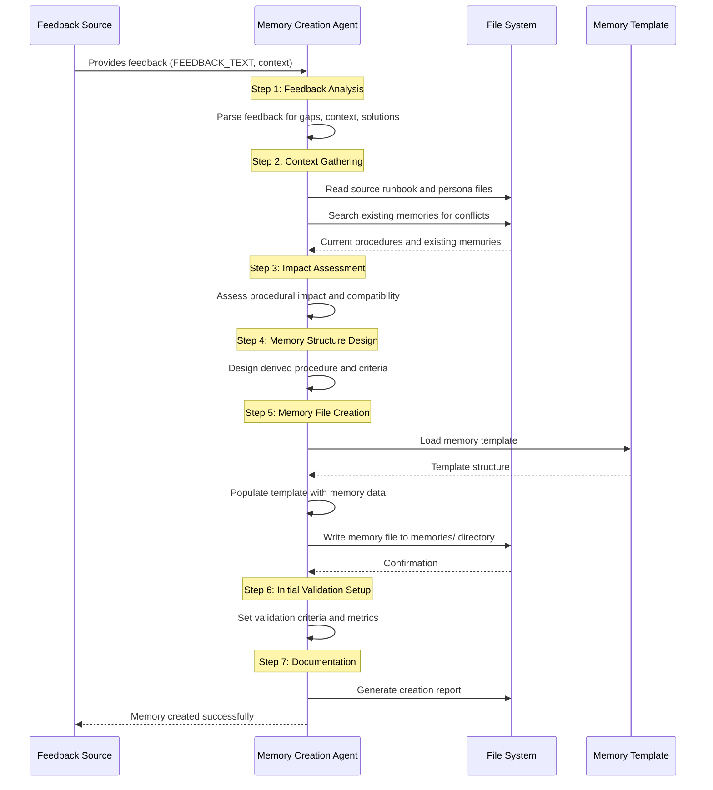

# Runbook: Memory Creation

## Objective

To systematically process analyst feedback and operational experience into structured institutional memory files that enhance AI agent procedural execution. This runbook transforms human insights into machine-readable adaptive learning components.

## Scope

Covers the complete workflow from raw analyst feedback to validated memory file creation, including feedback analysis, procedural impact assessment, memory structure creation, and initial validation setup. Excludes memory retirement and long-term validation processes (covered by separate runbooks).

## Inputs

- `${FEEDBACK_TEXT}`: Raw analyst feedback in natural language
- `${SOURCE_RUNBOOK}`: The runbook being modified/enhanced
- `${SOURCE_PERSONA}`: The persona context for the feedback
- `${CASE_CONTEXT}`: Optional case or scenario context
- `${FEEDBACK_SOURCE}`: Identifier of the analyst providing feedback

## Tools

- `read_file`: Read source runbook and persona files for context
- `search_files`: Check for existing related memories
- `write_to_file`: Create new memory file
- `list_files`: Browse institutional memory directories
- **Common Steps:** `common_steps/generate_report_file.md`

## Workflow Steps & Diagram

1. **Feedback Analysis:** Parse `${FEEDBACK_TEXT}` to identify:
   - **Procedural Gap**: What is missing or suboptimal in current procedure
   - **Organizational Context**: Specific organizational factors driving the need
   - **Proposed Solution**: What the analyst suggests should be done differently
   - **Scope**: Which runbook steps, personas, or scenarios are affected

2. **Context Gathering:** 
   - Read `${SOURCE_RUNBOOK}` to understand current procedures
   - Read `${SOURCE_PERSONA}` to understand role context and capabilities
   - Search existing memories: `search_files` in `institutional_memory/memories/` for similar or conflicting memories

3. **Impact Assessment:**
   - **Procedural Impact**: How would this change affect existing workflows
   - **Risk Assessment**: What are the benefits and potential risks
   - **Compatibility**: Does this conflict with existing memories or procedures
   - **Priority Level**: How critical is this improvement

4. **Memory Structure Design:**
   - Determine appropriate `memory_type` from standardized categories
   - Design `derived_procedure` that implements the feedback
   - Define `application_criteria` for when this memory should apply
   - Set initial `confidence` score (typically 0.0 for new memories)

5. **Memory File Creation:**
   - Generate unique filename: `[runbook]_[persona]_[sequence].md`
   - Use `MEMORY_FILE_TEMPLATE.md` as base structure
   - Populate all required YAML frontmatter fields
   - Write comprehensive memory content sections

6. **Initial Validation Setup:**
   - Document validation criteria and success metrics
   - Create initial application log entry
   - Set expiration date for review (typically 90 days)
   - Flag for initial validation testing

7. **Documentation:**
   - Log memory creation in feedback processing records
   - Update memory directory index if maintained
   - Generate creation report using `common_steps/generate_report_file.md`

## Decision Points

### Memory Type Classification

Choose the appropriate `memory_type` based on feedback content:

- **Procedure Modification**: Changes to existing steps
- **Procedure Addition**: New steps to be added
- **Context Enhancement**: Additional contextual information
- **Tool Substitution**: Different tools for specific scenarios
- **False Positive Pattern**: Recognition of benign patterns
- **Organizational Preference**: Org-specific operational preferences

### Confidence Scoring Guidelines

Set initial confidence based on feedback characteristics:

- **0.0**: Experimental ideas requiring validation
- **0.1-0.2**: Feedback from single source, limited context
- **0.3**: Feedback with clear rationale and context
- **Higher scores**: Reserved for memories with validation history

### Priority Assessment

Determine memory priority based on:

- **High**: Security-critical improvements, compliance requirements
- **Normal**: Efficiency improvements, quality enhancements  
- **Low**: Convenience features, minor optimizations

## Validation Requirements

New memories must include:

1. **Clear Application Criteria**: When and how to apply the memory
2. **Success Metrics**: How to measure memory effectiveness
3. **Fallback Procedures**: What to do if memory application fails
4. **Validation Plan**: How the memory will be tested and refined

## Completion Criteria

- Memory file created with all required YAML frontmatter fields
- Comprehensive content sections including feedback, context, and procedures
- Clear application criteria and success metrics defined
- Initial validation setup completed
- Memory indexed and discoverable by memory query systems
- Creation documented in feedback processing logs

## Expected Outputs

- **Memory File**: New `.md` file in `institutional_memory/memories/` directory
- **Memory Report**: Documentation of memory creation process and rationale
- **Validation Plan**: Framework for testing and refining the memory
- **Integration Notes**: How this memory relates to existing procedures and memories

## Quality Checklist

Before completing memory creation, verify:

- [ ] All required YAML fields populated correctly
- [ ] Memory type classification appropriate
- [ ] Derived procedure is clear and actionable
- [ ] Application criteria are specific and measurable
- [ ] No conflicts with existing memories
- [ ] Validation metrics are defined
- [ ] Fallback procedures specified
- [ ] Creation properly documented