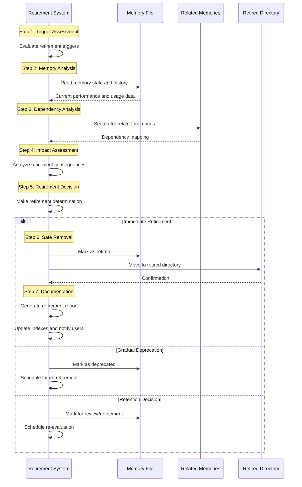

# Runbook: Memory Retirement

## Objective

To systematically identify, evaluate, and retire institutional memories that are no longer effective, relevant, or beneficial to operational procedures. This runbook maintains memory quality and prevents accumulation of obsolete or counterproductive learning artifacts.

## Scope

Covers identification of retirement candidates, impact assessment of retirement, safe removal procedures, and documentation of retirement rationale. Includes both automatic retirement based on performance metrics and manual retirement based on operational changes. Excludes memory creation and initial validation processes.

## Inputs

- `${MEMORY_FILE}`: Path to memory file being considered for retirement
- `${RETIREMENT_TRIGGER}`: Reason for retirement consideration (performance, obsolescence, supersession)
- `${RETIREMENT_REQUESTER}`: Source of retirement request (system, analyst, supervisor)
- `${REPLACEMENT_MEMORY}`: Optional path to replacement memory (if superseded)

## Tools

- `read_file`: Read memory file and related documentation
- `search_files`: Find related memories and dependencies
- `write_to_file`: Create retirement documentation
- `replace_in_file`: Mark memory as retired
- **Common Steps:** `common_steps/generate_report_file.md`

## Workflow Steps & Diagram

1. **Retirement Trigger Assessment:**
   - **Performance-Based**: Success rate below threshold, consistent failures
   - **Time-Based**: Memory unused for extended period, expired review date
   - **Obsolescence**: Organizational changes, tool changes, process changes
   - **Supersession**: Better memory available, conflicting memories
   - **Manual Request**: Analyst or supervisor explicit retirement request

2. **Memory Analysis:**
   - Read `${MEMORY_FILE}` to understand current state and history
   - Review application log for usage patterns and recent outcomes
   - Analyze confidence score trends and validation history
   - Assess memory type and organizational impact

3. **Dependency Analysis:**
   - Search for related memories that might reference this memory
   - Check for procedural dependencies in runbooks
   - Identify any reports or documentation that reference this memory
   - Assess impact on persona-specific workflows

4. **Impact Assessment:**
   - **Operational Impact**: What procedures will be affected by removal
   - **Knowledge Loss**: What insights will be lost with retirement
   - **Risk Assessment**: Risks of keeping vs. removing the memory
   - **Alternative Availability**: Are there replacement procedures or memories

5. **Retirement Decision:**
   - **Immediate Retirement**: Clear candidate with minimal impact
   - **Gradual Deprecation**: Phase out over time with transition period
   - **Conditional Retirement**: Retire only if replacement is available
   - **Retention**: Keep memory but mark for review/refinement

6. **Safe Removal Process:**
   - Mark memory as `status: retired` in frontmatter
   - Move memory file to `institutional_memory/retired/` directory
   - Update any dependent memories or documentation
   - Create retirement documentation and rationale

7. **Documentation and Notification:**
   - Generate retirement report documenting rationale and impact
   - Update memory indexes and catalogs
   - Notify relevant personas/analysts of retirement
   - Archive retirement record for future reference

## Retirement Criteria

### Automatic Retirement Triggers

**Performance-Based**:
- Success rate < 0.3 after 10+ applications
- 5+ consecutive failures without improvement
- Confidence score consistently declining for 30+ days

**Time-Based**:
- No applications for 180+ days
- Memory expired past review date by 90+ days
- Created >2 years ago with <5 total applications

**System-Based**:
- Referenced runbook deleted or significantly changed
- Referenced persona deprecated or modified
- Required tools no longer available

### Manual Retirement Triggers

**Organizational Changes**:
- Process changes making memory irrelevant
- Tool stack changes removing memory applicability
- Compliance changes requiring different procedures

**Quality Issues**:
- Memory creating confusion or errors
- Multiple analyst complaints about memory
- Memory conflicts with established best practices

### Supersession Triggers

**Better Alternative Available**:
- New memory with higher confidence for same scenario
- More comprehensive memory covering broader use cases
- Updated memory reflecting current procedures

## Retirement Process Types

### Immediate Retirement
For memories that are clearly obsolete or harmful:
1. Immediate status change to `retired`
2. Move to retired directory within 24 hours
3. Immediate notification to affected users
4. No transition period needed

### Gradual Deprecation  
For memories with some ongoing utility:
1. Status change to `deprecated` with retirement date
2. 30-day notice period for affected users
3. Alternative procedure recommendations provided
4. Final retirement after transition period

### Conditional Retirement
For memories awaiting replacement:
1. Status change to `pending_retirement`
2. Retirement contingent on replacement availability
3. Regular review until conditions met
4. Automatic retry of retirement process

## Documentation Requirements

### Retirement Record
Each retired memory must have:
- **Retirement Date**: When memory was retired
- **Retirement Reason**: Primary trigger for retirement
- **Impact Assessment**: What was affected by retirement
- **Alternative Recommendations**: What users should do instead
- **Approval Chain**: Who authorized the retirement

### Retirement Report
Generated for each retirement:
- Historical performance summary
- Usage patterns and trends
- Stakeholder impact analysis
- Lessons learned for future memory development

## Completion Criteria

- Memory retirement trigger properly validated and documented
- Dependency analysis completed with no critical dependencies identified
- Impact assessment confirms acceptable consequences of retirement
- Memory safely moved to retired directory with proper status marking
- Retirement documentation created and distributed to stakeholders
- Memory indexes and catalogs updated to reflect retirement
- Alternative procedures identified and communicated where applicable

## Expected Outputs

- **Retired Memory**: Memory file moved to retired directory with retirement metadata
- **Retirement Report**: Comprehensive documentation of retirement rationale and process
- **Impact Notification**: Communication to affected personas and analysts
- **Updated Indexes**: Memory catalogs reflecting current active memory set
- **Alternative Guidance**: Recommendations for replacement procedures or memories

## Quality Checklist

Before completing retirement, verify:

- [ ] Retirement triggers properly validated
- [ ] Dependency analysis shows no critical impacts
- [ ] Impact assessment completed and acceptable
- [ ] Replacement procedures identified where needed
- [ ] Memory properly marked as retired with metadata
- [ ] File moved to appropriate retired directory
- [ ] Retirement documentation comprehensive and clear
- [ ] Affected stakeholders notified appropriately
- [ ] Indexes and catalogs updated
- [ ] Process followed established governance requirements