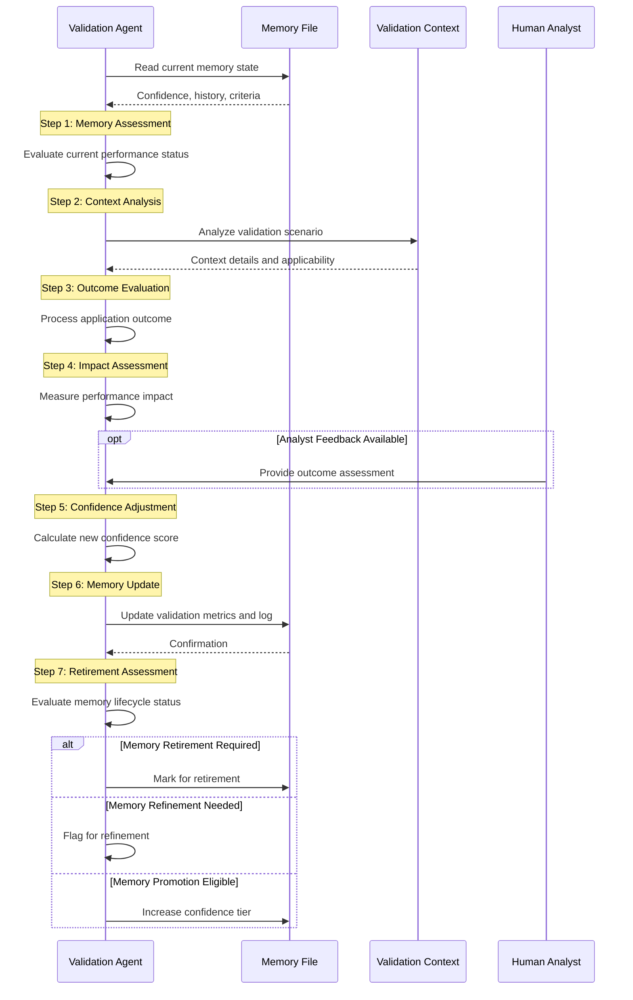

# Runbook: Memory Validation

## Objective

To systematically validate institutional memory effectiveness through controlled testing, outcome tracking, and confidence score adjustment. This runbook ensures memories provide genuine operational value before being trusted for autonomous application.

## Scope

Covers memory testing procedures, success/failure analysis, confidence score adjustment, and memory refinement or retirement decisions. Includes both new memory validation and ongoing performance monitoring of existing memories. Excludes initial memory creation (covered by `memory_creation.md`).

## Inputs

- `${MEMORY_FILE}`: Path to the memory file being validated
- `${VALIDATION_CONTEXT}`: Current case, alert, or scenario for testing
- `${APPLICATION_OUTCOME}`: Result of memory application (success/failure/partial)
- `${ANALYST_FEEDBACK}`: Optional analyst assessment of memory performance

## Tools

- `read_file`: Read memory file and related runbooks
- `replace_in_file`: Update memory confidence and application log
- `search_files`: Find similar validation scenarios
- **Common Steps:** `common_steps/generate_report_file.md`

## Workflow Steps & Diagram

1. **Memory Assessment:** Read `${MEMORY_FILE}` and evaluate:
   - Current confidence score and validation history
   - Number of previous applications (`validation_count`)
   - Success rate trends and recent performance
   - Expiration date and retirement criteria

2. **Validation Context Analysis:**
   - Confirm `${VALIDATION_CONTEXT}` matches memory application criteria
   - Verify persona and runbook context alignment
   - Check for any environmental changes affecting applicability

3. **Application Outcome Evaluation:**
   - **Success**: Memory applied correctly and produced expected results
   - **Failure**: Memory failed to apply or produced incorrect/harmful results
   - **Partial Success**: Memory partially helped but with limitations
   - **Not Applicable**: Context didn't match memory criteria (neutral)

4. **Performance Impact Assessment:**
   - **Efficiency**: Did memory improve task completion time?
   - **Quality**: Did memory enhance analysis depth or accuracy?
   - **Risk**: Did memory introduce any unintended risks or issues?
   - **User Experience**: Did memory improve analyst workflow?

5. **Confidence Score Adjustment:**
   - Calculate new success rate: `(previous_successes + current_result) / (validation_count + 1)`
   - Adjust confidence based on outcome patterns and trajectory
   - Apply confidence decay if memory hasn't been used recently
   - Consider analyst feedback in adjustment calculation

6. **Memory Update:**
   - Update `validation_count`, `success_rate`, and `confidence` fields
   - Add entry to application log with outcome details
   - Update `last_updated` timestamp
   - Add any new tags or context discovered during validation

7. **Retirement Assessment:**
   - **Retire if**: Success rate below threshold, expired, superseded by better memory
   - **Refine if**: Partial success patterns suggest memory needs adjustment
   - **Promote if**: High success rate and validation count meet promotion criteria

## Confidence Adjustment Rules

### Success-Based Adjustments

**Full Success**:
- First success: Confidence += 0.2 (max 0.5 for new memories)
- Subsequent successes: Confidence += 0.1 * (1 - current_confidence)
- Cap increases to prevent over-confidence

**Partial Success**:
- Confidence += 0.05 * (1 - current_confidence)
- Add refinement flag if pattern emerges

**Failure**:
- Confidence -= 0.3 (minimum 0.0)
- Add failure analysis to application log
- Flag for immediate review if confidence drops below 0.2

### Pattern-Based Adjustments

**Consistent Performance**:
- 5+ consistent successes: Confidence boost of +0.1
- 3+ consistent failures: Confidence reduction of -0.4

**Recent Activity Bonus**:
- Active use within 30 days: No decay
- 30-60 days idle: Confidence *= 0.95
- 60+ days idle: Confidence *= 0.9

## Validation Metrics

### Performance Indicators

**Efficiency Metrics**:
- Time reduction compared to original procedure
- Steps saved or automated
- Resource utilization improvement

**Quality Metrics**:
- Accuracy improvement in analysis
- Completeness of investigation
- False positive reduction

**User Experience Metrics**:
- Analyst satisfaction scores
- Workflow disruption level
- Learning curve requirements

## Retirement Criteria

Memories should be retired when:

- Success rate < 0.4 after 5+ applications
- Not used for 6+ months
- Superseded by better performing memory
- Organizational context changed making memory irrelevant
- Analyst explicitly requests retirement

## Completion Criteria

- Memory validation outcome properly classified and recorded
- Confidence score adjusted based on performance data and patterns
- Application log updated with detailed outcome information
- Memory lifecycle status assessed (continue/refine/retire)
- Validation metrics calculated and trends identified
- Any necessary follow-up actions flagged (refinement, retirement, promotion)

## Expected Outputs

- **Updated Memory File**: Revised confidence, success rate, and application log
- **Validation Report**: Analysis of memory performance and adjustment rationale
- **Lifecycle Recommendation**: Continue, refine, or retire recommendation
- **Performance Metrics**: Quantified impact of memory on operational efficiency and quality

## Quality Checklist

Before completing validation, verify:

- [ ] Application outcome accurately classified
- [ ] Confidence adjustment follows established rules
- [ ] Success rate calculation is correct
- [ ] Application log entry is comprehensive
- [ ] Performance impact properly assessed
- [ ] Retirement criteria evaluated
- [ ] Validation properly documented
- [ ] Follow-up actions identified and flagged