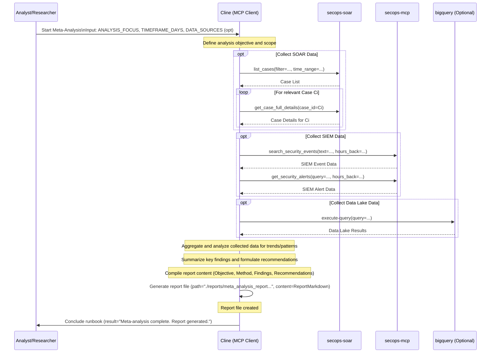

# Runbook: Meta-Analysis

## Objective

To analyze trends, patterns, and correlations across multiple incidents, alerts, or hunts over a defined period to identify broader security issues, detection gaps, recurring threats, or systemic vulnerabilities. This runbook enables strategic analysis that informs security program improvements, threat landscape understanding, and resource allocation decisions.

## Scope

Focuses on analyzing aggregated data from SIEM, SOAR, threat intelligence, and security tools to identify macro-level patterns and trends. Includes statistical analysis, pattern recognition, and correlation analysis across large datasets. Covers multiple timeframes and data sources to provide comprehensive insights. Excludes deep investigation of individual events unless specifically relevant to identified patterns or trends. Does not include real-time analysis or operational incident response activities.

## Inputs

*   `${ANALYSIS_TIMEFRAME_DAYS}`: Lookback period for the analysis (e.g., 90, 180).
*   `${ANALYSIS_FOCUS}`: The specific area of focus (e.g., "Recurring False Positives for Rule X", "Common Malware Families Observed", "Lateral Movement Patterns", "Effectiveness of Phishing Response").
*   *(Optional) `${DATA_SOURCES}`: Specific SIEM queries, SOAR case filters, or other data sources to use.*

## Tools

*   `secops-soar`: `list_cases`, `get_case_full_details` (for analyzing case data)
*   `secops-mcp`: `search_security_events`, `get_security_alerts` (for analyzing event/alert data)
*   `bigquery`: `execute-query` (if analyzing data lake information)
*   **Action:** Generate report file (e.g., using `write_to_file`)
*   *(Potentially other tools for data aggregation or visualization if available)*

## Workflow Steps & Diagram

1.  **Define Scope & Objective:** Clearly define the `${ANALYSIS_FOCUS}` and `${ANALYSIS_TIMEFRAME_DAYS}`. Identify necessary `${DATA_SOURCES}`.
2.  **Data Collection:** Gather relevant data using specified tools (e.g., export case details, run broad SIEM/BigQuery queries).
3.  **Data Aggregation & Analysis:** Aggregate the collected data. Analyze for trends, patterns, outliers, and correlations related to the `${ANALYSIS_FOCUS}`.
4.  **Synthesize Findings:** Summarize the key findings and insights derived from the analysis.
5.  **Develop Recommendations:** Based on the findings, formulate actionable recommendations (e.g., tune specific detection rules, update runbooks, implement new security controls, focus threat hunting efforts).
6.  **Generate Report:** Create a comprehensive report detailing the analysis objective, methodology, data sources, findings, and recommendations using the "Generate report file" action. Include visualizations (e.g., Mermaid diagrams summarizing data flow or findings) if applicable.

## Completion Criteria

- Analysis scope and objectives clearly defined with specific focus areas identified
- Relevant data sources identified and accessed including SIEM, SOAR, and external feeds
- Data collection completed across specified timeframe with appropriate sampling methods
- Statistical analysis performed using appropriate methodologies and tools
- Pattern recognition completed identifying trends, anomalies, and correlations
- Cross-source correlation analysis performed to validate findings across platforms
- Key insights synthesized with clear articulation of identified patterns and trends
- Root cause analysis completed for identified systemic issues or recurring problems
- Impact assessment performed measuring effect on security posture and operations
- Actionable recommendations formulated addressing identified gaps and opportunities
- Comprehensive report generated with executive summary and technical findings
- Data visualizations created to support key findings and recommendations

## Expected Outputs

- **Meta-Analysis Report**: Comprehensive document with findings, trends, and recommendations
- **Trend Analysis**: Statistical patterns identified across multiple dimensions and timeframes
- **Gap Assessment**: Identification of detection, response, or coverage gaps
- **Pattern Documentation**: Detailed description of recurring themes or anomalies
- **Recommendations Matrix**: Prioritized action items with implementation guidance
- **Data Visualizations**: Charts, graphs, and diagrams supporting key findings
- **Executive Summary**: High-level insights suitable for leadership consumption
- **Technical Appendix**: Detailed methodology, data sources, and analysis procedures
- **Workflow Documentation**: Sequence diagram showing actual MCP tools and servers used during execution
- **Runbook Reference**: Clear identification of which runbook was executed to generate the report
