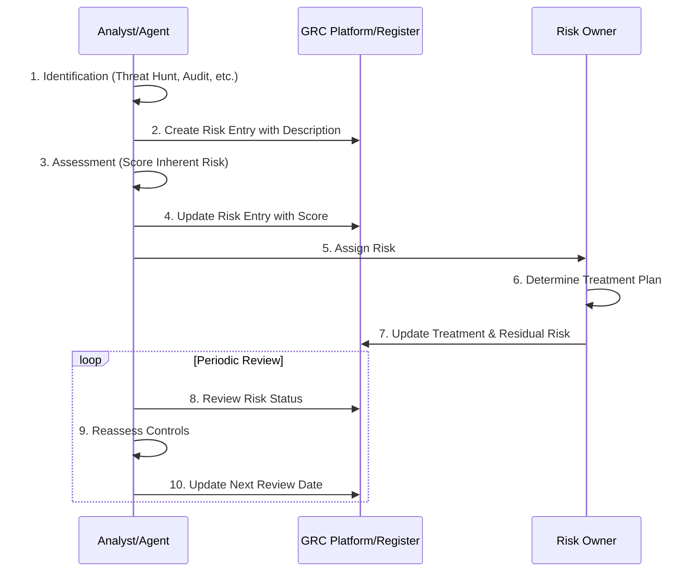

# Risk Register Management

In security operations (SecOps) and broader information security, a **Risk Register** is a centralized, living document or database used to identify, evaluate, track, and manage security risks across an organization.
If your SIEM (Security Information and Event Management) and security alerts deal with the *immediate tactical reality* (e.g., "Active brute-force attack on Port 22"), the Risk Register deals with the *strategic business reality* (e.g., "Legacy authentication systems lack MFA, creating a high probability of credential stuffing").
It acts as the bridge between technical vulnerabilities and business impact, allowing security teams to prioritize what gets fixed first based on data rather than gut feeling.

## Objective

To define the structure, lifecycle, and operational workflow for managing a Risk Register in a SecOps environment, ensuring risks are systematically identified, assessed, treated, and reviewed.

## Scope

This runbook covers the end-to-end lifecycle of tracking security risks—from initial identification through to ongoing review. It applies to all strategic risks impacting the organization's information security posture.

## Inputs

*   `${NEW_RISK_DATA}`: Details of a newly identified risk (e.g., from threat hunts, audits, pentests).
*   `${EXISTING_RISK_ID}`: The ID of an existing risk to be reviewed or updated.
*   `${TREATMENT_PLAN}`: The proposed mitigation, acceptance, transfer, or avoidance strategy.

## Tools

*   `GRC Platform` or `Shared Repository` (to store and update the register).
*   `secops-soar` (to track tasks related to risk mitigation).

## Core Attributes of a Risk Register

While formats range from a simple shared spreadsheet to dedicated GRC platforms, a functional risk register typically tracks these core attributes:

| Field | Purpose | Concrete Example |
| :---- | :---- | :---- |
| **Risk ID** | A unique identifier for tracking. | RSK-2026-042 |
| **Description** | Clearly states the threat, vulnerability, and consequence. | Unpatched Apache server in the DMZ could allow remote code execution, leading to customer data exfiltration. |
| **Risk Owner** | The specific person or team accountable for managing the risk. | VP of Infrastructure / SecOps Lead |
| **Inherent Risk** | The raw risk score (Likelihood × Impact) *before* any controls are applied. | **High** (Likelihood: 4/5, Impact: 5/5) |
| **Treatment Plan** | The decision made: Mitigate, Accept, Transfer (insurance), or Avoid. | **Mitigate** via virtual patching, followed by server migration. |
| **Residual Risk** | The remaining risk score *after* implementing the treatment plan. | **Low** (Likelihood: 1/5, Impact: 2/5) |
| **Status & Review** | Current progress and the next scheduled reassessment date. | *In Progress* — Next review: Oct 1, 2026 |

## Why SecOps Relies on It

1.  **Defends Resource Allocation:** When SecOps needs budget for a new tool or engineering hours to refactor legacy code, pointing to a documented "Critical" risk on the register provides business justification to leadership.
2.  **Prevents Alert Fatigue Traps:** A vulnerability scanner might flag 5,000 "high-severity" CVEs. The risk register helps map which of those actually expose critical business assets, filtering the noise.
3.  **Maintains Continuity:** If a key security engineer leaves, the organization doesn't lose track of accepted risks or ongoing remediation projects.
4.  **Audit & Compliance Proof:** Frameworks like SOC 2, ISO 27001, and NIST explicitly require organizations to prove they have a formalized, repeatable process for tracking and treating risk.

## Workflow Steps & Diagram

A risk register follows a continuous loop:

1.  **Identification:** Spot a new risk via threat hunting, penetration tests, vendor disclosures, or internal audits. If `${NEW_RISK_DATA}` is provided, use it as the primary source for the entry.
2.  **Assessment:** Score the risk using a standardized framework (like NIST SP 800-30 or FAIR) to keep scoring objective. If `${EXISTING_RISK_ID}` is provided, retrieve the current record for reassessment.
3.  **Treatment:** Assign and take action (Mitigate, Accept, Transfer, Avoid). Incorporate the `${TREATMENT_PLAN}` if one has been proposed.
4.  **Review:** Reassess risks quarterly or annually to ensure mitigation controls are still holding up.

## Completion Criteria

*   The risk has been fully documented with all required attributes (ID, Description, Owner, Inherent Risk, Treatment Plan, Residual Risk, Status & Review).
*   The risk has been accurately recorded in the central Risk Register.
*   A review schedule has been established and noted.
*   The agent generates an execution timestamp and runtime metrics summary upon completion.

## Rubric

**Error Handling & Resilience:**
- Did the agent gracefully handle situations where risk data was incomplete (e.g., missing impact scores) by requesting clarification rather than hallucinating values?

**Process Adherence:**
- Did the agent properly evaluate the risk through the full Identification, Assessment, Treatment, and Review lifecycle?
- Were the core attributes (Risk ID, Description, Owner, Scores) correctly mapped and populated?

**Output Verification:**
- Did the agent generate the Mermaid sequence diagram mapping the execution workflow?
- Were execution timestamp and runtime metrics logged in the final output?