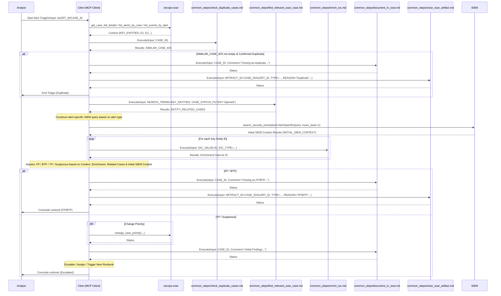

# Runbook: Alert Triage

## Objective

To provide a standardized process for the initial assessment and triage of incoming security alerts, determining if they represent a potential threat requiring further investigation or if they can be closed as false positives/duplicates. This runbook enables consistent, efficient decision-making for Tier 1 SOC analysts during initial alert assessment.

## Scope

Covers initial alert review, basic entity enrichment, duplicate detection, and decision-making based on predefined criteria. Includes alert-specific SIEM searches for immediate context and proper documentation of findings. Excludes deep investigation, containment actions, or advanced forensics - these are handled by escalation to appropriate specialized runbooks.

## Inputs

*   `${ALERT_ID}` or `${CASE_ID}`: The identifier for the alert or case to be triaged.
*   *(Optional) `${ALERT_DETAILS}`: Initial details provided by the alerting system.*

## Tools

*   `secops-soar`: `get_case_full_details`, `list_alerts_by_case`, `list_events_by_alert`, `post_case_comment`, `change_case_priority`, `siemplify_get_similar_cases`, `siemplify_close_case`, `siemplify_close_alert`
*   `secops-mcp`: `lookup_entity`, `get_ioc_matches`
*   `gti-mcp`: `get_file_report`, `get_domain_report`, `get_ip_address_report`, `get_url_report`
*   **Common Steps:** `common_steps/check_duplicate_cases.md`, `common_steps/enrich_ioc.md`, `common_steps/find_relevant_soar_case.md`, `common_steps/document_in_soar.md`, `common_steps/close_soar_artifact.md`
*   **Memory-Enhanced Steps:** `common_steps/query_memories.md`, `common_steps/apply_memory_procedure.md`, `common_steps/log_memory_outcome.md`

## Workflow Steps & Diagram

1.  **Receive Alert/Case:** Obtain the `${ALERT_ID}` or `${CASE_ID}`.
2.  **Gather Initial Context:** Use `secops-soar.get_case_full_details` or `list_alerts_by_case` / `list_events_by_alert` to understand the alert type, severity, involved entities (`KEY_ENTITIES`), and triggering events.
3.  **Check for Duplicates:** Execute `common_steps/check_duplicate_cases.md` with `${CASE_ID}`. Obtain `${SIMILAR_CASE_IDS}`.
4.  **Handle Duplicates:** If `${SIMILAR_CASE_IDS}` is not empty and duplication is confirmed by analyst:
    *   Execute `common_steps/document_in_soar.md` with `${CASE_ID}` and comment "Closing as duplicate of [Similar Case ID]".
    *   Execute `common_steps/close_soar_artifact.md` with:
        *   `${ARTIFACT_ID}` = `${CASE_ID}` (or `${ALERT_ID}`)
        *   `${ARTIFACT_TYPE}` = "Case" (or "Alert")
        *   `${CLOSURE_REASON}` = `"NOT_MALICIOUS"`
        *   `${ROOT_CAUSE}` = `"Similar case is already under investigation"`
        *   `${CLOSURE_COMMENT}` = "Closing as duplicate of [Similar Case ID]"
    *   End runbook execution.
5.  **Find Entity-Related Cases:**
    *   Execute `common_steps/find_relevant_soar_case.md` with `SEARCH_TERMS=KEY_ENTITIES` (list of entities from Step 2) and `CASE_STATUS_FILTER="Opened"`.
    *   Obtain `${ENTITY_RELATED_CASES}` (list of potentially relevant open case summaries/IDs).
6.  **(New) Alert-Specific SIEM Search:**
    *   Based on the alert type identified in Step 2, perform an initial targeted search using `secops-mcp.search_security_events` to gather immediate context. Examples:
        *   **Suspicious Login:** Search for related login events (success/failure) for the user/source IP/hostname around the alert time (e.g., last hour).
        *   **Malware Detection:** Search for process execution, file modification, or network events related to the file hash/endpoint around the alert time.
        *   **Network Alert:** Search for related network flows or DNS lookups involving the source/destination IPs/domains.
    *   Store a summary of findings in `${INITIAL_SIEM_CONTEXT}`. This helps provide more specific context before broader enrichment.
7.  **Memory-Enhanced Basic Enrichment:** Initialize `ENRICHMENT_RESULTS` structure. For each entity `Ei` in `KEY_ENTITIES`:
    
    **7a. Pre-Enrichment Memory Check:**
    *   Execute `common_steps/query_memories.md` with:
        *   `CURRENT_RUNBOOK` = "run_books/triage_alerts.md"
        *   `CURRENT_PERSONA` = [Current analyst persona - typically "personas/soc_analyst_tier_1.md"]
        *   `CURRENT_STEP` = "Step 7: Basic Enrichment"
        *   `STEP_CONTEXT` = "IOC enrichment, entity lookup, ${alert_type}"
        *   `CONFIDENCE_THRESHOLD` = 0.7
    *   Obtain `MEMORY_QUERY_RESULTS` containing applicable memories and recommendations.
    
    **7b. Enhanced Enrichment Execution:**
    *   **If High-Confidence Memory Found (≥0.9):**
        *   Execute `common_steps/apply_memory_procedure.md` with enhanced procedure automatically
        *   Log application with `common_steps/log_memory_outcome.md`
    *   **If Medium-Confidence Memory Found (0.7-0.89):**
        *   Present memory recommendation to analyst for approval
        *   If approved, execute enhanced procedure; otherwise use original
    *   **If No Relevant Memory or Low Confidence (<0.7):**
        *   Execute `common_steps/enrich_ioc.md` with `IOC_VALUE=Ei` and appropriate `IOC_TYPE` (original procedure)
    *   Store results (`GTI_FINDINGS`, `SIEM_ENTITY_SUMMARY`, `SIEM_IOC_MATCH_STATUS`, `MEMORY_ENHANCEMENT_APPLIED`) in `ENRICHMENT_RESULTS[Ei]`.
8.  **Memory-Enhanced Initial Assessment:** 
    
    **8a. Pattern Memory Check:**
    *   Query `institutional_memory/patterns/` for false positive patterns matching current alert characteristics
    *   Check `institutional_memory/adaptations/` for persona-specific assessment guidance
    *   Apply pattern recognition confidence scoring to assessment decision
    
    **8b. Assessment Decision:** Based on alert type, `ENRICHMENT_RESULTS`, `${ENTITY_RELATED_CASES}`, `${INITIAL_SIEM_CONTEXT}`, memory-enhanced patterns, and institutional knowledge, make an initial assessment:
    *   **False Positive (FP)** - Including pattern-matched organizational false positives
    *   **Benign True Positive (BTP)** - Expected/authorized activity per organizational context
    *   **Requires Further Investigation (True Positive - TP or Suspicious)** - Enhanced by institutional memory insights
9.  **Action Based on Assessment:**
    *   **If FP/BTP:**
        *   Execute `common_steps/document_in_soar.md` with `${CASE_ID}` and comment explaining FP/BTP reason.
        *   **Guidance for Closure:**
            *   Choose an appropriate `${CLOSURE_REASON}` (likely `NOT_MALICIOUS`).
            *   Choose a valid `${ROOT_CAUSE}` from the SOAR platform's predefined list (e.g., `"Legit action"`, `"Normal behavior"`, `"Other"`). Use `secops-soar.get_case_settings_root_causes` to list valid options if unsure.
        *   Execute `common_steps/close_soar_artifact.md` with `${ARTIFACT_ID}` = `${CASE_ID}` (or `${ALERT_ID}`), `${ARTIFACT_TYPE}` = "Case" (or "Alert"), the chosen `${CLOSURE_REASON}`/`${ROOT_CAUSE}`, and `${CLOSURE_COMMENT}` = "Closed as FP/BTP during triage.".
    *   **If TP/Suspicious:**
        *   *(Optional)* Use `secops-soar.change_case_priority` if needed.
        *   Execute `common_steps/document_in_soar.md` with `${CASE_ID}` and comment summarizing initial findings and assessment.
        *   Escalate/assign to the appropriate next tier or trigger a relevant investigation runbook (e.g., `deep_dive_ioc_analysis.md`, `suspicious_login_triage.md`).

## Completion Criteria

- Alert has been thoroughly assessed using available enrichment data
- Duplicate check completed and documented
- Alert-specific SIEM search performed for immediate context
- Basic enrichment completed for all key entities
- Assessment decision made (FP/BTP/TP/Suspicious) with clear rationale
- Findings properly documented in SOAR with detailed comments
- Alert either closed with appropriate reason/root cause or escalated to next tier
- If escalated, relevant investigation runbook triggered or analyst assigned
- All actions and decisions logged in case comments for audit trail

## Expected Outputs

- **Alert Status**: Closed (with reason) or escalated for further investigation
- **Assessment Classification**: False Positive (FP), Benign True Positive (BTP), True Positive (TP), or Suspicious
- **Documentation**: Comprehensive case comments including enrichment findings, duplicate check results, assessment rationale, and next steps
- **Escalation Info** (if applicable): Priority adjustment, assignment details, triggered runbook references
- **Audit Trail**: Complete record of all tools used, searches performed, and decisions made during triage process
- **Memory Enhancement Log**: Record of institutional memories applied, confidence levels, and effectiveness
- **Pattern Matching Results**: Documentation of organizational pattern recognition and false positive identification
- **Workflow Documentation**: Sequence diagram showing actual MCP tools and servers used during execution
- **Runbook Reference**: Clear identification of which runbook was executed to generate the report
