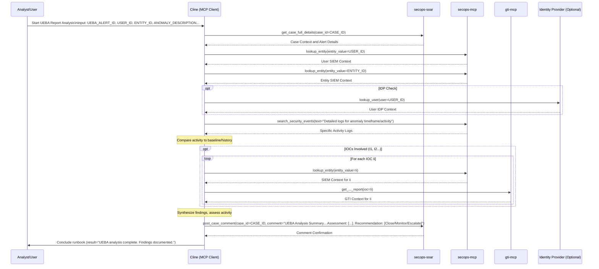

# Runbook: UEBA Report Analysis

## Objective

To analyze a User and Entity Behavior Analytics (UEBA) alert or report, investigate the anomalous activity, gather contextual information, and determine if it represents a genuine security threat or benign behavioral deviation. This runbook provides systematic analysis of behavioral anomalies using baseline comparison, activity correlation, and risk assessment methodologies.

## Scope

Focuses on analyzing UEBA findings, correlating with SIEM logs, user context, and historical behavioral patterns. Includes entity enrichment, timeline reconstruction, and risk assessment based on deviation severity and potential impact. Covers user activity analysis, resource access patterns, and anomaly investigation. May involve basic enrichment but excludes deep endpoint forensics or network traffic analysis unless specifically indicated by the anomaly type.

## Inputs

*   `${UEBA_ALERT_ID}` or `${CASE_ID}`: Identifier for the UEBA alert or associated SOAR case.
*   `${USER_ID}`: The primary user associated with the anomalous behavior.
*   `${ENTITY_ID}`: Any primary entity (e.g., hostname, resource) associated with the behavior.
*   `${ANOMALY_DESCRIPTION}`: Description of the anomalous behavior reported by the UEBA system.
*   *(Optional) `${BASELINE_INFO}`: Information about the user's normal baseline behavior, if available.*

## Tools

*   `secops-soar`: `get_case_full_details`, `list_alerts_by_case`, `list_events_by_alert`, `post_case_comment`
*   `secops-mcp`: `lookup_entity` (for user and entity), `search_security_events` (for detailed activity logs)
*   `gti-mcp`: (Relevant enrichment tools if IOCs are involved)
*   *(Potentially Identity Provider tools like `okta-mcp.lookup_okta_user`)*

## Workflow Steps & Diagram

1.  **Receive Alert/Case:** Obtain the UEBA alert details, associated user/entity, `${CASE_ID}` etc.
2.  **Gather Context:** Use `get_case_full_details` (if applicable). Use `lookup_entity` for `${USER_ID}` and `${ENTITY_ID}` to get SIEM context. *(Optional: Check IDP for user status/recent activity)*.
3.  **Analyze Specific Activity:** Use `search_security_events` to retrieve detailed logs corresponding to the timeframe and activity described in `${ANOMALY_DESCRIPTION}`.
4.  **Compare to Baseline:** Compare the observed activity against known baseline behavior (`${BASELINE_INFO}`) or historical patterns observed in SIEM logs. Identify deviations.
5.  **Enrich Associated Indicators:** If the anomalous activity involves specific IOCs (IPs, domains, files), enrich them using `lookup_entity` and GTI tools.
6.  **Synthesize Findings:** Combine UEBA anomaly details, SIEM logs, baseline comparison, and enrichment data. Determine if the activity is explainable, benign, or suspicious/malicious.
7.  **Document & Recommend:** Document findings and assessment in the SOAR case using `post_case_comment`. Recommend next steps: [Close as Benign/Explained | Monitor User/Entity | Escalate for Incident Response (Trigger relevant runbook like Compromised User Account Response)].

## Completion Criteria

- UEBA alert details and anomaly description thoroughly analyzed and documented
- User and entity context gathered including baseline behavior and historical patterns
- Detailed activity logs retrieved covering the timeframe of anomalous behavior
- Baseline comparison performed to quantify deviation from normal patterns
- Correlated events identified across multiple log sources and security tools
- Risk assessment completed considering deviation severity and potential impact
- Identity provider integration checked for account status and recent changes
- Associated IOCs enriched if anomalous activity involves external indicators
- Timeline reconstruction completed showing sequence of anomalous events
- Findings synthesized with clear determination of threat vs. benign activity
- Recommendations formulated for appropriate response actions
- Complete documentation provided in SOAR with analysis methodology and conclusions

## Expected Outputs

- **UEBA Analysis Report**: Comprehensive analysis of behavioral anomaly with context
- **Baseline Comparison**: Quantitative analysis of deviation from normal behavior patterns
- **Activity Timeline**: Chronological reconstruction of events during anomalous period
- **Risk Assessment**: Evaluation of potential security impact and threat likelihood
- **Correlation Results**: Related events and patterns identified across security tools
- **User Context**: Identity information, role details, and recent account changes
- **IOC Enrichment**: Analysis of any external indicators associated with anomalous activity
- **Response Recommendations**: Specific next steps based on threat assessment
- **Workflow Documentation**: Sequence diagram showing actual MCP tools and servers used during execution
- **Runbook Reference**: Clear identification of which runbook was executed to generate the report
