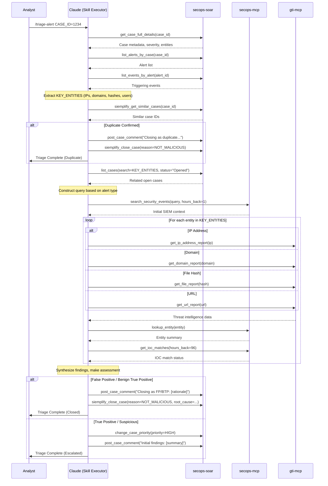

# Alert Triage - Reference Documentation

## Workflow Diagram

## Completion Criteria

The triage is complete when:

- [ ] Alert has been thoroughly assessed using available enrichment data
- [ ] Duplicate check completed and documented
- [ ] Alert-specific SIEM search performed for immediate context
- [ ] Basic enrichment completed for all key entities
- [ ] Assessment decision made (FP/BTP/TP/Suspicious) with clear rationale
- [ ] Findings properly documented in SOAR with detailed comments
- [ ] Alert either closed with appropriate reason/root cause or escalated to next tier
- [ ] If escalated, relevant investigation runbook triggered or analyst assigned
- [ ] All actions and decisions logged in case comments for audit trail

## Expected Outputs

| Output | Description |
|--------|-------------|
| Alert Status | Closed (with reason) or escalated for further investigation |
| Assessment Classification | False Positive (FP), Benign True Positive (BTP), True Positive (TP), or Suspicious |
| Documentation | Comprehensive case comments including enrichment findings, duplicate check results, assessment rationale, and next steps |
| Escalation Info | (if applicable) Priority adjustment, assignment details, triggered runbook references |
| Audit Trail | Complete record of all tools used, searches performed, and decisions made |

## Evaluation Rubric

### 1. Context & Duplicates (20 Points)

| Criterion | Points | Description |
|-----------|--------|-------------|
| Initial Context | 10 | Did Claude retrieve full details for the case/alert? |
| Duplicate Check | 10 | Did Claude correctly check for and handle duplicates? |

### 2. Analysis & Enrichment (30 Points)

| Criterion | Points | Description |
|-----------|--------|-------------|
| SIEM Context | 15 | Did Claude perform a targeted SIEM search relevant to the alert type? |
| Entity Enrichment | 15 | Did Claude enrich key entities using GTI and/or SIEM lookups? |

### 3. Assessment & Decision (20 Points)

| Criterion | Points | Description |
|-----------|--------|-------------|
| Classification | 10 | Did Claude make a clear determination (FP/BTP/TP) supported by evidence? |
| Documentation | 10 | Did Claude document findings and rationale in SOAR case comments? |

### 4. Visual Summary (10 Points)

| Criterion | Points | Description |
|-----------|--------|-------------|
| Sequence Diagram | 10 | Did Claude produce a valid Mermaid sequence diagram of actions taken? |

### 5. Operational Metadata (10 Points)

| Criterion | Points | Description |
|-----------|--------|-------------|
| Date/Time | 5 | Did Claude record the date and time of execution? |
| Cost/Runtime | 5 | Did Claude attempt to record token usage and runtime duration? |

### 6. Resilience & Quality (10 Points)

| Criterion | Points | Description |
|-----------|--------|-------------|
| Error Handling | 5 | Did Claude handle tool failures gracefully without hallucinating? |
| Output Formatting | 5 | Is the final output well-structured and clean? |

### Critical Failures (Automatic Failure)

These errors result in automatic failure regardless of other scores:

- **Closing a True Positive as False Positive** - Missing a real threat
- **Failing to check for duplicates** - Wasting resources on already-investigated alerts
- **Hallucinating evidence** - Fabricating findings to support a closure decision

## Alert Type Quick Reference

### Suspicious Login Alerts
- Search for: Login events (success/failure) for user and source IP
- Time window: Around alert time (1 hour)
- Key indicators: Geographic anomalies, impossible travel, brute force patterns

### Malware Detection Alerts
- Search for: Process execution, file modifications, network connections
- Correlate: File hash, endpoint hostname, parent processes
- Key indicators: Known malware signatures, suspicious behaviors, C2 communication

### Network Alerts
- Search for: Network flows, DNS lookups, connection patterns
- Correlate: Source/destination IPs, domains, ports
- Key indicators: Known malicious IPs/domains, unusual traffic volumes, beaconing

## Related Runbooks

If escalation is needed, consider these follow-up runbooks:

| Alert Type | Recommended Runbook |
|------------|---------------------|
| Suspicious Login | `suspicious_login_triage.md` |
| Malware | `malware_triage.md` |
| IOC-focused | `deep_dive_ioc_analysis.md` |
| General Investigation | `prioritize_and_investigate_a_case.md` |
